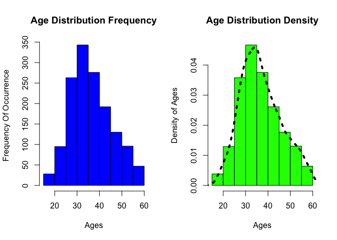

## Abstract

DDS Analytics is a analytics company that specializes in talent management solutions for Fortune 1000 companies. Talent management is defined as the iterative process of developing and retaining employees. It may include workforce planning, employee training programs, identifying high-potential employees and reducing/preventing voluntary employee turnover (attrition). To gain a competitive edge over its competition, DDS Analytics is planning to leverage data science for talent management. The executive leadership has identified predicting employee turnover as its first application of data science for talent management. This repo is the full data analysis of our findings after exploring the many facets of the data.

## I. Introduction

Talent is a precious commodity, especially in the corporate sector. Every organization no matter how big or small seeks not only to hire, but also to retain the best talent possible. Employee retention however, is much easier said than done these days, especially when the average amount of years an employee is likely to remain at a specific place of employment is [4.5 years](https://www.forbes.com/sites/davidsturt/2016/01/13/true-or-false-employees-today-only-stay-one-or-two-years/#6736606b6b4c) as of 2014. What are the factors that lead to employee attrition? This is an age old question that most companies continue to try to answer. Can employee attrition be slowed, or avoided all together? Is there any data to support that job satisfaction is the main cause for an employee remaining at a job? All these questions and more will be explored in this study. Our goal is to find sound answers to these questions rooted in strong statistical analysis of a dataset we have gathered from some of the most influential companies in the world.


## II. Background

As a Talent Management organization we set out to leverage the strength of Data Science in order to maintain the best employees at our organization DDS Analytics. In order for the organization to move forward in this endeavor it was neccessary to study the key factors in maintaining the best employees. As a result this study was launched by the management team in order to gain more insight into this arena.


## III.  Methodology

### Data Cleaning & Preparation

In order to make sure our data was ready for proper analysis we had to go through a series of steps in order to prepare the data. These steps include the following...

1. Data Import
2. Data Type Conversion
3. Factorization For Catagorical Variables
4. Handling of Missing or Inaccurate Values

We will discuss the process of each step below.

#### Data Import

We have obtained a dataset which incldudes 35 variables with 1470 observations. The dataset is will be referred to as `talentMgmtData`. In order to better understand our data we needed to proceed with cleaning it appropriately.

#### Data Type Conversion

Analysis could not be done properly if our variables are not in the correct type. Several of the numerical based variables showed up as doubles which was not neccessarily appropriate for research and analysis. For example, the years of experience for specfic employees needed to be converted to integer types, and Standard Working hours had no reason to show as a double, so it to was converted to an integer. This process was followed for each one of the 35 variables on order to ensure each columns assigned data type made sense for the context of the study.

#### Factorization For Catagorical Variables

Within our `talentMgmtData` we noticed that there were several columns that were improperly listed as integers when they were simply catagories. In order for us to be able to do factor analysis we picked out the columns that would be better suited to be catagories instead of integers so that we could get a better understanding of how our talent was spread out over different situations. For example, Columns like Department, BusinessTravel, Over18, & Jobsatisfaction to name a few, are all better suited to be treated as catagorical variables for our research purposes. As a result, we have converted the appropriate columns that explained how our data points were separated by making them factors instead of numerical values.

#### Handling of Missing or Inaccurate Values

In order for our mathematical calculations to work we had to convert many of our data points into numerical values so that our regression analysis would be more accurate. For example, DailyRate, Total Working Years, Years with Current Manager, are all examples of numerical based data points that can have mathematical operations performed on them. As a result we located variables like these and made sure the data type was appropriate giving us more flexibility during analysis.

#### DATA CLEANING

```r
#a.	Read the csv into R and take a look at the data set.  Output how many rows and columns the data.frame is.
library(readxl)
talentMgmtData <- read_excel("datasets/CaseStudy2-data.xlsx")
dim(talentMgmtData)
```

```
## [1] 1470   35
```

```r
#b	The column names are either too much or not enough.  Change the column names so that they do not have spaces, underscores, slashes, and the like. All column names should be under 12 characters. TODO: Make sure you're updating your codebook with information on the tidied data set as well.

names(talentMgmtData) <- c("Age","Attrition","BusinessTrvl","DailyRate","Department","DistFromHome","YrsOfEdu","EduField","EmployeeCnt","EmployeeNum","EnvSatfctn","Gender","HourlyRate","JobInvolmnt","JobLevel","JobRole","JobSatfctn","MaritalStat","MonthlyIncm","MonthlyRate","NumCmpWorked","Over18","OverTime","PrcntSalHike","PerfRating","RlnSatfctn","StandardHrs","StockOptLvl","TtlWrkngYrs","TrngTmsLstYr","WrkLifeBal","YrsAtCompany","YrsInCrntRl","YrsSncLstPrn","YrsWthCurMgr")

names(talentMgmtData)
```

```
##  [1] "Age"          "Attrition"    "BusinessTrvl" "DailyRate"   
##  [5] "Department"   "DistFromHome" "YrsOfEdu"     "EduField"    
##  [9] "EmployeeCnt"  "EmployeeNum"  "EnvSatfctn"   "Gender"      
## [13] "HourlyRate"   "JobInvolmnt"  "JobLevel"     "JobRole"     
## [17] "JobSatfctn"   "MaritalStat"  "MonthlyIncm"  "MonthlyRate" 
## [21] "NumCmpWorked" "Over18"       "OverTime"     "PrcntSalHike"
## [25] "PerfRating"   "RlnSatfctn"   "StandardHrs"  "StockOptLvl" 
## [29] "TtlWrkngYrs"  "TrngTmsLstYr" "WrkLifeBal"   "YrsAtCompany"
## [33] "YrsInCrntRl"  "YrsSncLstPrn" "YrsWthCurMgr"
```

```r
# c	Some columns are, due to Qualtrics, malfunctioning.

# TODO: Discuss with team, delete Over18 and StandardHrs(80hrs) columns
talentMgmtData$Over18 <- NULL
talentMgmtData <- subset(talentMgmtData, select = -c(StandardHrs))

# d	Make sure your columns are the proper data types (i.e., numeric, character, etc.).  If they are incorrect, convert them. 
str(talentMgmtData)
```

```
## Classes 'tbl_df', 'tbl' and 'data.frame':	1470 obs. of  33 variables:
##  $ Age         : num  41 49 37 33 27 32 59 30 38 36 ...
##  $ Attrition   : chr  "Yes" "No" "Yes" "No" ...
##  $ BusinessTrvl: chr  "Travel_Rarely" "Travel_Frequently" "Travel_Rarely" "Travel_Frequently" ...
##  $ DailyRate   : num  1102 279 1373 1392 591 ...
##  $ Department  : chr  "Sales" "Research & Development" "Research & Development" "Research & Development" ...
##  $ DistFromHome: num  1 8 2 3 2 2 3 24 23 27 ...
##  $ YrsOfEdu    : num  2 1 2 4 1 2 3 1 3 3 ...
##  $ EduField    : chr  "Life Sciences" "Life Sciences" "Other" "Life Sciences" ...
##  $ EmployeeCnt : num  1 1 1 1 1 1 1 1 1 1 ...
##  $ EmployeeNum : num  1 2 4 5 7 8 10 11 12 13 ...
##  $ EnvSatfctn  : num  2 3 4 4 1 4 3 4 4 3 ...
##  $ Gender      : chr  "Female" "Male" "Male" "Female" ...
##  $ HourlyRate  : num  94 61 92 56 40 79 81 67 44 94 ...
##  $ JobInvolmnt : num  3 2 2 3 3 3 4 3 2 3 ...
##  $ JobLevel    : num  2 2 1 1 1 1 1 1 3 2 ...
##  $ JobRole     : chr  "Sales Executive" "Research Scientist" "Laboratory Technician" "Research Scientist" ...
##  $ JobSatfctn  : num  4 2 3 3 2 4 1 3 3 3 ...
##  $ MaritalStat : chr  "Single" "Married" "Single" "Married" ...
##  $ MonthlyIncm : num  5993 5130 2090 2909 3468 ...
##  $ MonthlyRate : num  19479 24907 2396 23159 16632 ...
##  $ NumCmpWorked: num  8 1 6 1 9 0 4 1 0 6 ...
##  $ OverTime    : chr  "Yes" "No" "Yes" "Yes" ...
##  $ PrcntSalHike: num  11 23 15 11 12 13 20 22 21 13 ...
##  $ PerfRating  : num  3 4 3 3 3 3 4 4 4 3 ...
##  $ RlnSatfctn  : num  1 4 2 3 4 3 1 2 2 2 ...
##  $ StockOptLvl : num  0 1 0 0 1 0 3 1 0 2 ...
##  $ TtlWrkngYrs : num  8 10 7 8 6 8 12 1 10 17 ...
##  $ TrngTmsLstYr: num  0 3 3 3 3 2 3 2 2 3 ...
##  $ WrkLifeBal  : num  1 3 3 3 3 2 2 3 3 2 ...
##  $ YrsAtCompany: num  6 10 0 8 2 7 1 1 9 7 ...
##  $ YrsInCrntRl : num  4 7 0 7 2 7 0 0 7 7 ...
##  $ YrsSncLstPrn: num  0 1 0 3 2 3 0 0 1 7 ...
##  $ YrsWthCurMgr: num  5 7 0 0 2 6 0 0 8 7 ...
```

```r
#TODO: Discuss with team foll. factor levels of dataset
unique(talentMgmtData$BusinessTrvl)
```

```
## [1] "Travel_Rarely"     "Travel_Frequently" "Non-Travel"
```

```r
unique(talentMgmtData$JobRole)
```

```
## [1] "Sales Executive"           "Research Scientist"       
## [3] "Laboratory Technician"     "Manufacturing Director"   
## [5] "Healthcare Representative" "Manager"                  
## [7] "Sales Representative"      "Research Director"        
## [9] "Human Resources"
```

```r
unique(talentMgmtData$Attrition)
```

```
## [1] "Yes" "No"
```

```r
unique(talentMgmtData$Department)
```

```
## [1] "Sales"                  "Research & Development"
## [3] "Human Resources"
```

```r
unique(talentMgmtData$EduField)
```

```
## [1] "Life Sciences"    "Other"            "Medical"         
## [4] "Marketing"        "Technical Degree" "Human Resources"
```

```r
library(dplyr)
```

```
## 
## Attaching package: 'dplyr'
```

```
## The following objects are masked from 'package:stats':
## 
##     filter, lag
```

```
## The following objects are masked from 'package:base':
## 
##     intersect, setdiff, setequal, union
```

```r
#Get an Idea of the current format of the colums we are currently using.
glimpse(talentMgmtData)
```

```
## Observations: 1,470
## Variables: 33
## $ Age          <dbl> 41, 49, 37, 33, 27, 32, 59, 30, 38, 36, 35, 29, 3...
## $ Attrition    <chr> "Yes", "No", "Yes", "No", "No", "No", "No", "No",...
## $ BusinessTrvl <chr> "Travel_Rarely", "Travel_Frequently", "Travel_Rar...
## $ DailyRate    <dbl> 1102, 279, 1373, 1392, 591, 1005, 1324, 1358, 216...
## $ Department   <chr> "Sales", "Research & Development", "Research & De...
## $ DistFromHome <dbl> 1, 8, 2, 3, 2, 2, 3, 24, 23, 27, 16, 15, 26, 19, ...
## $ YrsOfEdu     <dbl> 2, 1, 2, 4, 1, 2, 3, 1, 3, 3, 3, 2, 1, 2, 3, 4, 2...
## $ EduField     <chr> "Life Sciences", "Life Sciences", "Other", "Life ...
## $ EmployeeCnt  <dbl> 1, 1, 1, 1, 1, 1, 1, 1, 1, 1, 1, 1, 1, 1, 1, 1, 1...
## $ EmployeeNum  <dbl> 1, 2, 4, 5, 7, 8, 10, 11, 12, 13, 14, 15, 16, 18,...
## $ EnvSatfctn   <dbl> 2, 3, 4, 4, 1, 4, 3, 4, 4, 3, 1, 4, 1, 2, 3, 2, 1...
## $ Gender       <chr> "Female", "Male", "Male", "Female", "Male", "Male...
## $ HourlyRate   <dbl> 94, 61, 92, 56, 40, 79, 81, 67, 44, 94, 84, 49, 3...
## $ JobInvolmnt  <dbl> 3, 2, 2, 3, 3, 3, 4, 3, 2, 3, 4, 2, 3, 3, 2, 4, 4...
## $ JobLevel     <dbl> 2, 2, 1, 1, 1, 1, 1, 1, 3, 2, 1, 2, 1, 1, 1, 3, 1...
## $ JobRole      <chr> "Sales Executive", "Research Scientist", "Laborat...
## $ JobSatfctn   <dbl> 4, 2, 3, 3, 2, 4, 1, 3, 3, 3, 2, 3, 3, 4, 3, 1, 2...
## $ MaritalStat  <chr> "Single", "Married", "Single", "Married", "Marrie...
## $ MonthlyIncm  <dbl> 5993, 5130, 2090, 2909, 3468, 3068, 2670, 2693, 9...
## $ MonthlyRate  <dbl> 19479, 24907, 2396, 23159, 16632, 11864, 9964, 13...
## $ NumCmpWorked <dbl> 8, 1, 6, 1, 9, 0, 4, 1, 0, 6, 0, 0, 1, 0, 5, 1, 0...
## $ OverTime     <chr> "Yes", "No", "Yes", "Yes", "No", "No", "Yes", "No...
## $ PrcntSalHike <dbl> 11, 23, 15, 11, 12, 13, 20, 22, 21, 13, 13, 12, 1...
## $ PerfRating   <dbl> 3, 4, 3, 3, 3, 3, 4, 4, 4, 3, 3, 3, 3, 3, 3, 3, 3...
## $ RlnSatfctn   <dbl> 1, 4, 2, 3, 4, 3, 1, 2, 2, 2, 3, 4, 4, 3, 2, 3, 4...
## $ StockOptLvl  <dbl> 0, 1, 0, 0, 1, 0, 3, 1, 0, 2, 1, 0, 1, 1, 0, 1, 2...
## $ TtlWrkngYrs  <dbl> 8, 10, 7, 8, 6, 8, 12, 1, 10, 17, 6, 10, 5, 3, 6,...
## $ TrngTmsLstYr <dbl> 0, 3, 3, 3, 3, 2, 3, 2, 2, 3, 5, 3, 1, 2, 4, 1, 5...
## $ WrkLifeBal   <dbl> 1, 3, 3, 3, 3, 2, 2, 3, 3, 2, 3, 3, 2, 3, 3, 3, 2...
## $ YrsAtCompany <dbl> 6, 10, 0, 8, 2, 7, 1, 1, 9, 7, 5, 9, 5, 2, 4, 10,...
## $ YrsInCrntRl  <dbl> 4, 7, 0, 7, 2, 7, 0, 0, 7, 7, 4, 5, 2, 2, 2, 9, 2...
## $ YrsSncLstPrn <dbl> 0, 1, 0, 3, 2, 3, 0, 0, 1, 7, 0, 0, 4, 1, 0, 8, 0...
## $ YrsWthCurMgr <dbl> 5, 7, 0, 0, 2, 6, 0, 0, 8, 7, 3, 8, 3, 2, 3, 8, 5...
```

```r
# Factor appropriate columns 
talentMgmtData$Department <- as.factor(talentMgmtData$Department)
talentMgmtData$BusinessTrvl <- as.factor(talentMgmtData$BusinessTrvl)
talentMgmtData$OverTime <- as.factor(talentMgmtData$OverTime)
talentMgmtData$EduField <- as.factor(talentMgmtData$EduField)
talentMgmtData$Gender <- as.factor(talentMgmtData$Gender)
talentMgmtData$Attrition <- as.factor(talentMgmtData$Attrition)
talentMgmtData$MaritalStat <- as.factor(talentMgmtData$MaritalStat)
talentMgmtData$JobRole <- as.factor(talentMgmtData$JobRole)
talentMgmtData$EnvSatfctn <- as.factor(talentMgmtData$EnvSatfctn)
talentMgmtData$JobLevel <- as.factor(talentMgmtData$JobLevel)
talentMgmtData$StockOptLvl <- as.factor(talentMgmtData$StockOptLvl)
talentMgmtData$PerfRating <- as.factor(talentMgmtData$PerfRating)
talentMgmtData$EmployeeCnt <- as.factor(talentMgmtData$EmployeeCnt)
talentMgmtData$JobInvolmnt <- as.factor(talentMgmtData$JobInvolmnt)
talentMgmtData$RlnSatfctn <- as.factor(talentMgmtData$RlnSatfctn)
talentMgmtData$WrkLifeBal <- as.factor(talentMgmtData$WrkLifeBal)
talentMgmtData$JobSatfctn <- as.factor(talentMgmtData$JobSatfctn)
# handle numeric based columns to show as double or integer if need be.
talentMgmtData$Age <- as.integer(talentMgmtData$Age)
talentMgmtData$EmployeeNum <- as.integer(talentMgmtData$EmployeeNum)
talentMgmtData$DistFromHome <- as.integer(talentMgmtData$DistFromHome)
talentMgmtData$YrsOfEdu <- as.integer(talentMgmtData$YrsOfEdu)
talentMgmtData$DailyRate <- as.numeric(talentMgmtData$DailyRate)
talentMgmtData$TtlWrkngYrs <- as.integer(talentMgmtData$TtlWrkngYrs)
talentMgmtData$YrsAtCompany <- as.integer(talentMgmtData$YrsAtCompany)
talentMgmtData$NumCmpWorked <- as.integer(talentMgmtData$NumCmpWorked)
talentMgmtData$YrsInCrntRl <- as.integer(talentMgmtData$YrsInCrntRl)
talentMgmtData$YrsSncLstPrn <- as.integer(talentMgmtData$YrsSncLstPrn)
talentMgmtData$YrsWthCurMgr <- as.integer(talentMgmtData$YrsWthCurMgr)
talentMgmtData$TrngTmsLstYr <- as.integer(talentMgmtData$TrngTmsLstYr)
#Take a look at data after type conversions are applied to the appropriate columns
glimpse(talentMgmtData)
```

```
## Observations: 1,470
## Variables: 33
## $ Age          <int> 41, 49, 37, 33, 27, 32, 59, 30, 38, 36, 35, 29, 3...
## $ Attrition    <fctr> Yes, No, Yes, No, No, No, No, No, No, No, No, No...
## $ BusinessTrvl <fctr> Travel_Rarely, Travel_Frequently, Travel_Rarely,...
## $ DailyRate    <dbl> 1102, 279, 1373, 1392, 591, 1005, 1324, 1358, 216...
## $ Department   <fctr> Sales, Research & Development, Research & Develo...
## $ DistFromHome <int> 1, 8, 2, 3, 2, 2, 3, 24, 23, 27, 16, 15, 26, 19, ...
## $ YrsOfEdu     <int> 2, 1, 2, 4, 1, 2, 3, 1, 3, 3, 3, 2, 1, 2, 3, 4, 2...
## $ EduField     <fctr> Life Sciences, Life Sciences, Other, Life Scienc...
## $ EmployeeCnt  <fctr> 1, 1, 1, 1, 1, 1, 1, 1, 1, 1, 1, 1, 1, 1, 1, 1, ...
## $ EmployeeNum  <int> 1, 2, 4, 5, 7, 8, 10, 11, 12, 13, 14, 15, 16, 18,...
## $ EnvSatfctn   <fctr> 2, 3, 4, 4, 1, 4, 3, 4, 4, 3, 1, 4, 1, 2, 3, 2, ...
## $ Gender       <fctr> Female, Male, Male, Female, Male, Male, Female, ...
## $ HourlyRate   <dbl> 94, 61, 92, 56, 40, 79, 81, 67, 44, 94, 84, 49, 3...
## $ JobInvolmnt  <fctr> 3, 2, 2, 3, 3, 3, 4, 3, 2, 3, 4, 2, 3, 3, 2, 4, ...
## $ JobLevel     <fctr> 2, 2, 1, 1, 1, 1, 1, 1, 3, 2, 1, 2, 1, 1, 1, 3, ...
## $ JobRole      <fctr> Sales Executive, Research Scientist, Laboratory ...
## $ JobSatfctn   <fctr> 4, 2, 3, 3, 2, 4, 1, 3, 3, 3, 2, 3, 3, 4, 3, 1, ...
## $ MaritalStat  <fctr> Single, Married, Single, Married, Married, Singl...
## $ MonthlyIncm  <dbl> 5993, 5130, 2090, 2909, 3468, 3068, 2670, 2693, 9...
## $ MonthlyRate  <dbl> 19479, 24907, 2396, 23159, 16632, 11864, 9964, 13...
## $ NumCmpWorked <int> 8, 1, 6, 1, 9, 0, 4, 1, 0, 6, 0, 0, 1, 0, 5, 1, 0...
## $ OverTime     <fctr> Yes, No, Yes, Yes, No, No, Yes, No, No, No, No, ...
## $ PrcntSalHike <dbl> 11, 23, 15, 11, 12, 13, 20, 22, 21, 13, 13, 12, 1...
## $ PerfRating   <fctr> 3, 4, 3, 3, 3, 3, 4, 4, 4, 3, 3, 3, 3, 3, 3, 3, ...
## $ RlnSatfctn   <fctr> 1, 4, 2, 3, 4, 3, 1, 2, 2, 2, 3, 4, 4, 3, 2, 3, ...
## $ StockOptLvl  <fctr> 0, 1, 0, 0, 1, 0, 3, 1, 0, 2, 1, 0, 1, 1, 0, 1, ...
## $ TtlWrkngYrs  <int> 8, 10, 7, 8, 6, 8, 12, 1, 10, 17, 6, 10, 5, 3, 6,...
## $ TrngTmsLstYr <int> 0, 3, 3, 3, 3, 2, 3, 2, 2, 3, 5, 3, 1, 2, 4, 1, 5...
## $ WrkLifeBal   <fctr> 1, 3, 3, 3, 3, 2, 2, 3, 3, 2, 3, 3, 2, 3, 3, 3, ...
## $ YrsAtCompany <int> 6, 10, 0, 8, 2, 7, 1, 1, 9, 7, 5, 9, 5, 2, 4, 10,...
## $ YrsInCrntRl  <int> 4, 7, 0, 7, 2, 7, 0, 0, 7, 7, 4, 5, 2, 2, 2, 9, 2...
## $ YrsSncLstPrn <int> 0, 1, 0, 3, 2, 3, 0, 0, 1, 7, 0, 0, 4, 1, 0, 8, 0...
## $ YrsWthCurMgr <int> 5, 7, 0, 0, 2, 6, 0, 0, 8, 7, 3, 8, 3, 2, 3, 8, 5...
```

### Exploratory Data Analysis

Now that the data has been prepared and formatted accordingly it is neccessary to explore it to its depths. For a dataset this large we will start off taking a look at some of the variables of interests and how they relate to each other.

When it comes to jobs the first thing that we want to look at is our age distribution. This is an imporatant step in our EDA process as we would like to get an idea of how old or young our these individuals in our entire dataset as it might give us a good place to start.


```r
par(mfrow=c(1,2))
hist(talentMgmtData$Age, xlab= "Ages",
     ylab="Frequency Of Occurrence",
     main= "Age Distribution Frequency",
     col = "blue")
hist(talentMgmtData$Age,
     xlab= "Ages",
     col="green",
     freq= FALSE,  ylab= "Density of Ages", main= "Age Distribution Density")
lines(density(talentMgmtData$Age), lty="dotted", lwd=4)
```

<!-- -->

Based on the chart above we can see that our age range is between 20 and 60 with a large portion of ages being between 25 and 45. This is insightful as it might help us with interpretation of our findings moving forward. It is also worth noting that  between 30 and 35  is the most occurring age of all the age groups with over 350 recorded ages within this group! 

## IV. Results


## IV. Discussion And Conclusions


## References


