## Abstract

DDS Analytics is a analytics company that specializes in talent management solutions for Fortune 1000 companies. Talent management is defined as the iterative process of developing and retaining employees. It may include workforce planning, employee training programs, identifying high-potential employees and reducing/preventing voluntary employee turnover (attrition). To gain a competitive edge over its competition, DDS Analytics is planning to leverage data science for talent management. The executive leadership has identified predicting employee turnover as its first application of data science for talent management. This report is the full data analysis of our findings after exploring the many facets of the data.

## I. Introduction

Talent is a precious commodity, especially in the corporate sector. Every organization no matter how big or small seeks not only to hire, but also to retain the best talent possible. Employee retention however, is much easier said than done these days, especially when the average amount of years an employee is likely to remain at a specific place of employment is [4.5 years](https://www.forbes.com/sites/davidsturt/2016/01/13/true-or-false-employees-today-only-stay-one-or-two-years/#6736606b6b4c) as of 2014. What are the factors that lead to employee attrition? This is an age old question that most companies continue to try to answer. Can employee attrition be slowed, or avoided all together? Is there any data to support that job satisfaction is the main cause for an employee remaining at a job? All these questions and more will be explored in this study. Our goal is to find sound answers to these questions rooted in strong statistical analysis of a dataset we have gathered from some of the most influential companies in the world.


## II. Background

As a Talent Management organization we set out to leverage the strength of Data Science in order to maintain the best employees at our organization DDS Analytics. In order for the organization to move forward in this endeavor it was necessary to study the key factors in maintaining the best employees. As a result this study was launched by the management team in order to gain more insight into this arena.


## III.  Methodology

### Data Cleaning & Preparation

In order to make sure our data was ready for proper analysis we had to go through a series of steps in order to prepare the data. These steps include the following...

1. Data Import
2. Data Type Conversion
3. Factorization For Categorical Variables
4. Handling of Missing or Inaccurate Values

We will discuss the process of each step below.

#### Data Import

We have obtained a dataset which includes 35 variables with 1470 observations. The dataset is will be referred to as `talentMgmtData`. In order to better understand our data we needed to proceed with cleaning it appropriately.

#### Data Type Conversion

Analysis could not be done properly if our variables are not in the correct type. Several of the numerical based variables showed up as doubles which was not necessarily appropriate for research and analysis. For example, the years of experience for specific employees needed to be converted to integer types, and Standard Working hours had no reason to show as a double, so it to was converted to an integer. This process was followed for each one of the 35 variables on order to ensure each columns assigned data type made sense for the context of the study.

#### Factorization For Catagorical Variables

Within our `talentMgmtData` we noticed that there were several columns that were improperly listed as integers when they were simply categories. In order for us to be able to do factor analysis we picked out the columns that would be better suited to be categories instead of integers so that we could get a better understanding of how our talent was spread out over different situations. For example, Columns like Department, BusinessTravel, Over18, & Job satisfaction to name a few, are all better suited to be treated as categorical variables for our research purposes. As a result, we have converted the appropriate columns that explained how our data points were separated by making them factors instead of numerical values.

#### Handling of Missing or Inaccurate Values

In order for our mathematical calculations to work we had to convert many of our data points into numerical values so that our regression analysis would be more accurate. For example, DailyRate, Total Working Years, Years with Current Manager, are all examples of numerical based data points that can have mathematical operations performed on them. As a result we located variables like these and made sure the data type was appropriate giving us more flexibility during analysis.

#### DATA CLEANING

```r
#2a.	Read the csv into R and take a look at the data set.  Output how many rows and columns the data.frame is.
library(readxl)
talentMgmtData <- read_excel("datasets/CaseStudy2-data.xlsx")
dim(talentMgmtData)
```

```
## [1] 1470   35
```

```r
names(talentMgmtData)
```

```
##  [1] "Age"                      "Attrition"               
##  [3] "BusinessTravel"           "DailyRate"               
##  [5] "Department"               "DistanceFromHome"        
##  [7] "Education"                "EducationField"          
##  [9] "EmployeeCount"            "EmployeeNumber"          
## [11] "EnvironmentSatisfaction"  "Gender"                  
## [13] "HourlyRate"               "JobInvolvement"          
## [15] "JobLevel"                 "JobRole"                 
## [17] "JobSatisfaction"          "MaritalStatus"           
## [19] "MonthlyIncome"            "MonthlyRate"             
## [21] "NumCompaniesWorked"       "Over18"                  
## [23] "OverTime"                 "PercentSalaryHike"       
## [25] "PerformanceRating"        "RelationshipSatisfaction"
## [27] "StandardHours"            "StockOptionLevel"        
## [29] "TotalWorkingYears"        "TrainingTimesLastYear"   
## [31] "WorkLifeBalance"          "YearsAtCompany"          
## [33] "YearsInCurrentRole"       "YearsSinceLastPromotion" 
## [35] "YearsWithCurrManager"
```

```r
#2b	The column names are either too much or not enough.  Change the column names so that they do not have spaces, underscores, slashes, and the like. All column names should be under 12 characters. Make sure you're updating your codebook with information on the tidied data set as well.

names(talentMgmtData) <- c("Age","Attrition","BusinessTrvl","DailyRate","Department","DistFromHome","YrsOfEdu","EduField","EmployeeCnt","EmployeeNum","EnvSatfctn","Gender","HourlyRate","JobInvolmnt","JobLevel","JobRole","JobSatfctn","MaritalStat","MonthlyIncm","MonthlyRate","NumCmpWorked","Over18","OverTime","PrcntSalHike","PerfRating","RlnSatfctn","StandardHrs","StockOptLvl","TtlWrkngYrs","TrngTmsLstYr","WrkLifeBal","YrsAtCompany","YrsInCrntRl","YrsSncLstPrn","YrsWthCurMgr")

#changed variable names
names(talentMgmtData)
```

```
##  [1] "Age"          "Attrition"    "BusinessTrvl" "DailyRate"   
##  [5] "Department"   "DistFromHome" "YrsOfEdu"     "EduField"    
##  [9] "EmployeeCnt"  "EmployeeNum"  "EnvSatfctn"   "Gender"      
## [13] "HourlyRate"   "JobInvolmnt"  "JobLevel"     "JobRole"     
## [17] "JobSatfctn"   "MaritalStat"  "MonthlyIncm"  "MonthlyRate" 
## [21] "NumCmpWorked" "Over18"       "OverTime"     "PrcntSalHike"
## [25] "PerfRating"   "RlnSatfctn"   "StandardHrs"  "StockOptLvl" 
## [29] "TtlWrkngYrs"  "TrngTmsLstYr" "WrkLifeBal"   "YrsAtCompany"
## [33] "YrsInCrntRl"  "YrsSncLstPrn" "YrsWthCurMgr"
```

```r
# 2c	Some columns are, due to Qualtrics, malfunctioning.

# deleting Over18, EmployeeCount, EmployeeNumber and StandardHrs(80hrs) columns that doesn't have much impact on the analysis we are doing

talentMgmtData <- subset(talentMgmtData, select = -c(Over18,EmployeeCnt,EmployeeNum,StandardHrs))

# 2d	Make sure your columns are the proper data types (i.e., numeric, character, etc.).  If they are incorrect, convert them. 

library(dplyr)
```

```
## 
## Attaching package: 'dplyr'
```

```
## The following objects are masked from 'package:stats':
## 
##     filter, lag
```

```
## The following objects are masked from 'package:base':
## 
##     intersect, setdiff, setequal, union
```

```r
#Get an Idea of the current format of the colums we are currently using.
glimpse(talentMgmtData)
```

```
## Observations: 1,470
## Variables: 31
## $ Age          <dbl> 41, 49, 37, 33, 27, 32, 59, 30, 38, 36, 35, 29, 3...
## $ Attrition    <chr> "Yes", "No", "Yes", "No", "No", "No", "No", "No",...
## $ BusinessTrvl <chr> "Travel_Rarely", "Travel_Frequently", "Travel_Rar...
## $ DailyRate    <dbl> 1102, 279, 1373, 1392, 591, 1005, 1324, 1358, 216...
## $ Department   <chr> "Sales", "Research & Development", "Research & De...
## $ DistFromHome <dbl> 1, 8, 2, 3, 2, 2, 3, 24, 23, 27, 16, 15, 26, 19, ...
## $ YrsOfEdu     <dbl> 2, 1, 2, 4, 1, 2, 3, 1, 3, 3, 3, 2, 1, 2, 3, 4, 2...
## $ EduField     <chr> "Life Sciences", "Life Sciences", "Other", "Life ...
## $ EnvSatfctn   <dbl> 2, 3, 4, 4, 1, 4, 3, 4, 4, 3, 1, 4, 1, 2, 3, 2, 1...
## $ Gender       <chr> "Female", "Male", "Male", "Female", "Male", "Male...
## $ HourlyRate   <dbl> 94, 61, 92, 56, 40, 79, 81, 67, 44, 94, 84, 49, 3...
## $ JobInvolmnt  <dbl> 3, 2, 2, 3, 3, 3, 4, 3, 2, 3, 4, 2, 3, 3, 2, 4, 4...
## $ JobLevel     <dbl> 2, 2, 1, 1, 1, 1, 1, 1, 3, 2, 1, 2, 1, 1, 1, 3, 1...
## $ JobRole      <chr> "Sales Executive", "Research Scientist", "Laborat...
## $ JobSatfctn   <dbl> 4, 2, 3, 3, 2, 4, 1, 3, 3, 3, 2, 3, 3, 4, 3, 1, 2...
## $ MaritalStat  <chr> "Single", "Married", "Single", "Married", "Marrie...
## $ MonthlyIncm  <dbl> 5993, 5130, 2090, 2909, 3468, 3068, 2670, 2693, 9...
## $ MonthlyRate  <dbl> 19479, 24907, 2396, 23159, 16632, 11864, 9964, 13...
## $ NumCmpWorked <dbl> 8, 1, 6, 1, 9, 0, 4, 1, 0, 6, 0, 0, 1, 0, 5, 1, 0...
## $ OverTime     <chr> "Yes", "No", "Yes", "Yes", "No", "No", "Yes", "No...
## $ PrcntSalHike <dbl> 11, 23, 15, 11, 12, 13, 20, 22, 21, 13, 13, 12, 1...
## $ PerfRating   <dbl> 3, 4, 3, 3, 3, 3, 4, 4, 4, 3, 3, 3, 3, 3, 3, 3, 3...
## $ RlnSatfctn   <dbl> 1, 4, 2, 3, 4, 3, 1, 2, 2, 2, 3, 4, 4, 3, 2, 3, 4...
## $ StockOptLvl  <dbl> 0, 1, 0, 0, 1, 0, 3, 1, 0, 2, 1, 0, 1, 1, 0, 1, 2...
## $ TtlWrkngYrs  <dbl> 8, 10, 7, 8, 6, 8, 12, 1, 10, 17, 6, 10, 5, 3, 6,...
## $ TrngTmsLstYr <dbl> 0, 3, 3, 3, 3, 2, 3, 2, 2, 3, 5, 3, 1, 2, 4, 1, 5...
## $ WrkLifeBal   <dbl> 1, 3, 3, 3, 3, 2, 2, 3, 3, 2, 3, 3, 2, 3, 3, 3, 2...
## $ YrsAtCompany <dbl> 6, 10, 0, 8, 2, 7, 1, 1, 9, 7, 5, 9, 5, 2, 4, 10,...
## $ YrsInCrntRl  <dbl> 4, 7, 0, 7, 2, 7, 0, 0, 7, 7, 4, 5, 2, 2, 2, 9, 2...
## $ YrsSncLstPrn <dbl> 0, 1, 0, 3, 2, 3, 0, 0, 1, 7, 0, 0, 4, 1, 0, 8, 0...
## $ YrsWthCurMgr <dbl> 5, 7, 0, 0, 2, 6, 0, 0, 8, 7, 3, 8, 3, 2, 3, 8, 5...
```

```r
#check for NAs
any(is.na(talentMgmtData))
```

```
## [1] FALSE
```

```r
#inspecting the different factor levels of variables of interest
unique(talentMgmtData$BusinessTrvl)
```

```
## [1] "Travel_Rarely"     "Travel_Frequently" "Non-Travel"
```

```r
unique(talentMgmtData$JobRole)
```

```
## [1] "Sales Executive"           "Research Scientist"       
## [3] "Laboratory Technician"     "Manufacturing Director"   
## [5] "Healthcare Representative" "Manager"                  
## [7] "Sales Representative"      "Research Director"        
## [9] "Human Resources"
```

```r
unique(talentMgmtData$OverTime)
```

```
## [1] "Yes" "No"
```

```r
unique(talentMgmtData$Gender)
```

```
## [1] "Female" "Male"
```

```r
unique(talentMgmtData$MaritalStat)
```

```
## [1] "Single"   "Married"  "Divorced"
```

```r
unique(talentMgmtData$Attrition)
```

```
## [1] "Yes" "No"
```

```r
unique(talentMgmtData$Department)
```

```
## [1] "Sales"                  "Research & Development"
## [3] "Human Resources"
```

```r
unique(talentMgmtData$EduField)
```

```
## [1] "Life Sciences"    "Other"            "Medical"         
## [4] "Marketing"        "Technical Degree" "Human Resources"
```

```r
# Factor appropriate columns 
talentMgmtData$Department <- as.factor(talentMgmtData$Department)
talentMgmtData$BusinessTrvl <- as.factor(talentMgmtData$BusinessTrvl)
talentMgmtData$OverTime <- as.factor(talentMgmtData$OverTime)
talentMgmtData$EduField <- as.factor(talentMgmtData$EduField)
talentMgmtData$Gender <- as.factor(talentMgmtData$Gender)
talentMgmtData$Attrition <- as.factor(talentMgmtData$Attrition)
talentMgmtData$MaritalStat <- as.factor(talentMgmtData$MaritalStat)
talentMgmtData$JobRole <- as.factor(talentMgmtData$JobRole)
talentMgmtData$EnvSatfctn <- as.factor(talentMgmtData$EnvSatfctn)
talentMgmtData$JobLevel <- as.factor(talentMgmtData$JobLevel)
talentMgmtData$StockOptLvl <- as.factor(talentMgmtData$StockOptLvl)
talentMgmtData$PerfRating <- as.factor(talentMgmtData$PerfRating)
talentMgmtData$JobInvolmnt <- as.factor(talentMgmtData$JobInvolmnt)
talentMgmtData$RlnSatfctn <- as.factor(talentMgmtData$RlnSatfctn)
talentMgmtData$WrkLifeBal <- as.factor(talentMgmtData$WrkLifeBal)
talentMgmtData$JobSatfctn <- as.factor(talentMgmtData$JobSatfctn)
# handle numeric based columns to show as double or integer if need be.
talentMgmtData$Age <- as.integer(talentMgmtData$Age)
talentMgmtData$DistFromHome <- as.integer(talentMgmtData$DistFromHome)
talentMgmtData$YrsOfEdu <- as.integer(talentMgmtData$YrsOfEdu)
talentMgmtData$DailyRate <- as.numeric(talentMgmtData$DailyRate)
talentMgmtData$TtlWrkngYrs <- as.integer(talentMgmtData$TtlWrkngYrs)
talentMgmtData$YrsAtCompany <- as.integer(talentMgmtData$YrsAtCompany)
talentMgmtData$NumCmpWorked <- as.integer(talentMgmtData$NumCmpWorked)
talentMgmtData$YrsInCrntRl <- as.integer(talentMgmtData$YrsInCrntRl)
talentMgmtData$YrsSncLstPrn <- as.integer(talentMgmtData$YrsSncLstPrn)
talentMgmtData$YrsWthCurMgr <- as.integer(talentMgmtData$YrsWthCurMgr)
talentMgmtData$TrngTmsLstYr <- as.integer(talentMgmtData$TrngTmsLstYr)
#Take a look at data after type conversions are applied to the appropriate columns
glimpse(talentMgmtData)
```

```
## Observations: 1,470
## Variables: 31
## $ Age          <int> 41, 49, 37, 33, 27, 32, 59, 30, 38, 36, 35, 29, 3...
## $ Attrition    <fct> Yes, No, Yes, No, No, No, No, No, No, No, No, No,...
## $ BusinessTrvl <fct> Travel_Rarely, Travel_Frequently, Travel_Rarely, ...
## $ DailyRate    <dbl> 1102, 279, 1373, 1392, 591, 1005, 1324, 1358, 216...
## $ Department   <fct> Sales, Research & Development, Research & Develop...
## $ DistFromHome <int> 1, 8, 2, 3, 2, 2, 3, 24, 23, 27, 16, 15, 26, 19, ...
## $ YrsOfEdu     <int> 2, 1, 2, 4, 1, 2, 3, 1, 3, 3, 3, 2, 1, 2, 3, 4, 2...
## $ EduField     <fct> Life Sciences, Life Sciences, Other, Life Science...
## $ EnvSatfctn   <fct> 2, 3, 4, 4, 1, 4, 3, 4, 4, 3, 1, 4, 1, 2, 3, 2, 1...
## $ Gender       <fct> Female, Male, Male, Female, Male, Male, Female, M...
## $ HourlyRate   <dbl> 94, 61, 92, 56, 40, 79, 81, 67, 44, 94, 84, 49, 3...
## $ JobInvolmnt  <fct> 3, 2, 2, 3, 3, 3, 4, 3, 2, 3, 4, 2, 3, 3, 2, 4, 4...
## $ JobLevel     <fct> 2, 2, 1, 1, 1, 1, 1, 1, 3, 2, 1, 2, 1, 1, 1, 3, 1...
## $ JobRole      <fct> Sales Executive, Research Scientist, Laboratory T...
## $ JobSatfctn   <fct> 4, 2, 3, 3, 2, 4, 1, 3, 3, 3, 2, 3, 3, 4, 3, 1, 2...
## $ MaritalStat  <fct> Single, Married, Single, Married, Married, Single...
## $ MonthlyIncm  <dbl> 5993, 5130, 2090, 2909, 3468, 3068, 2670, 2693, 9...
## $ MonthlyRate  <dbl> 19479, 24907, 2396, 23159, 16632, 11864, 9964, 13...
## $ NumCmpWorked <int> 8, 1, 6, 1, 9, 0, 4, 1, 0, 6, 0, 0, 1, 0, 5, 1, 0...
## $ OverTime     <fct> Yes, No, Yes, Yes, No, No, Yes, No, No, No, No, Y...
## $ PrcntSalHike <dbl> 11, 23, 15, 11, 12, 13, 20, 22, 21, 13, 13, 12, 1...
## $ PerfRating   <fct> 3, 4, 3, 3, 3, 3, 4, 4, 4, 3, 3, 3, 3, 3, 3, 3, 3...
## $ RlnSatfctn   <fct> 1, 4, 2, 3, 4, 3, 1, 2, 2, 2, 3, 4, 4, 3, 2, 3, 4...
## $ StockOptLvl  <fct> 0, 1, 0, 0, 1, 0, 3, 1, 0, 2, 1, 0, 1, 1, 0, 1, 2...
## $ TtlWrkngYrs  <int> 8, 10, 7, 8, 6, 8, 12, 1, 10, 17, 6, 10, 5, 3, 6,...
## $ TrngTmsLstYr <int> 0, 3, 3, 3, 3, 2, 3, 2, 2, 3, 5, 3, 1, 2, 4, 1, 5...
## $ WrkLifeBal   <fct> 1, 3, 3, 3, 3, 2, 2, 3, 3, 2, 3, 3, 2, 3, 3, 3, 2...
## $ YrsAtCompany <int> 6, 10, 0, 8, 2, 7, 1, 1, 9, 7, 5, 9, 5, 2, 4, 10,...
## $ YrsInCrntRl  <int> 4, 7, 0, 7, 2, 7, 0, 0, 7, 7, 4, 5, 2, 2, 2, 9, 2...
## $ YrsSncLstPrn <int> 0, 1, 0, 3, 2, 3, 0, 0, 1, 7, 0, 0, 4, 1, 0, 8, 0...
## $ YrsWthCurMgr <int> 5, 7, 0, 0, 2, 6, 0, 0, 8, 7, 3, 8, 3, 2, 3, 8, 5...
```

### Preliminary Analysis


---

####3.A####


```r
talentData <- talentMgmtData[talentMgmtData$Age > 18, ]
range(talentData$Age)
```

```
## [1] 19 60
```

As we can see above, only Ages 19 to 60 exists within our dataset.

Now that the data has been prepared and formatted accordingly it is necessary to explore it to its depths.

####3.B Descriptive statistics####

Lets check descriptive statistics for some of the data we have

```r
library(knitr)
library(kableExtra)
```

```
## Warning: package 'kableExtra' was built under R version 3.4.4
```

```r
DescriptiveStatistics<-c("min", "max", "mean", "sd")
HourlyRate <- c(min(talentData$HourlyRate), max(talentData$HourlyRate), mean(talentData$HourlyRate), sd(talentData$HourlyRate))
MonthlyIncome <- c(min(talentData$MonthlyIncm), max(talentData$MonthlyIncm), mean(talentData$MonthlyIncm), sd(talentData$MonthlyIncm))
TotalWorkYears <- c(min(talentData$TtlWrkngYrs), max(talentData$TtlWrkngYrs), mean(talentData$TtlWrkngYrs), sd(talentData$TtlWrkngYrs))
Age <- c(min(talentData$Age), max(talentData$Age), mean(talentData$Age), sd(talentData$Age)) 
YearsAtCompany <-c(min(talentData$YrsAtCompany), max(talentData$YrsAtCompany), mean(talentData$YrsAtCompany), sd(talentData$YrsAtCompany))
MonthlyRate <- c(min(talentData$MonthlyRate), max(talentData$MonthlyRate), mean(talentData$MonthlyRate), sd(talentData$MonthlyRate))
YrsOfEdu <- c(min(talentData$YrsOfEdu), max(talentData$YrsOfEdu), mean(talentData$YrsOfEdu), sd(talentData$YrsOfEdu))
table <- data.frame(DescriptiveStatistics, HourlyRate, MonthlyRate, MonthlyIncome, TotalWorkYears, YearsAtCompany, Age,  YrsOfEdu)
table %>%
  kable("html") %>%
  kable_styling()
```

<table class="table" style="margin-left: auto; margin-right: auto;">
 <thead>
  <tr>
   <th style="text-align:left;"> DescriptiveStatistics </th>
   <th style="text-align:right;"> HourlyRate </th>
   <th style="text-align:right;"> MonthlyRate </th>
   <th style="text-align:right;"> MonthlyIncome </th>
   <th style="text-align:right;"> TotalWorkYears </th>
   <th style="text-align:right;"> YearsAtCompany </th>
   <th style="text-align:right;"> Age </th>
   <th style="text-align:right;"> YrsOfEdu </th>
  </tr>
 </thead>
<tbody>
  <tr>
   <td style="text-align:left;"> min </td>
   <td style="text-align:right;"> 30.00000 </td>
   <td style="text-align:right;"> 2094.000 </td>
   <td style="text-align:right;"> 1009.000 </td>
   <td style="text-align:right;"> 0.000000 </td>
   <td style="text-align:right;"> 0.000000 </td>
   <td style="text-align:right;"> 19.000000 </td>
   <td style="text-align:right;"> 1.000000 </td>
  </tr>
  <tr>
   <td style="text-align:left;"> max </td>
   <td style="text-align:right;"> 100.00000 </td>
   <td style="text-align:right;"> 26999.000 </td>
   <td style="text-align:right;"> 19999.000 </td>
   <td style="text-align:right;"> 40.000000 </td>
   <td style="text-align:right;"> 40.000000 </td>
   <td style="text-align:right;"> 60.000000 </td>
   <td style="text-align:right;"> 5.000000 </td>
  </tr>
  <tr>
   <td style="text-align:left;"> mean </td>
   <td style="text-align:right;"> 65.87893 </td>
   <td style="text-align:right;"> 14312.212 </td>
   <td style="text-align:right;"> 6530.207 </td>
   <td style="text-align:right;"> 11.341313 </td>
   <td style="text-align:right;"> 7.046512 </td>
   <td style="text-align:right;"> 37.027360 </td>
   <td style="text-align:right;"> 2.915185 </td>
  </tr>
  <tr>
   <td style="text-align:left;"> sd </td>
   <td style="text-align:right;"> 20.34338 </td>
   <td style="text-align:right;"> 7124.669 </td>
   <td style="text-align:right;"> 4706.273 </td>
   <td style="text-align:right;"> 7.757034 </td>
   <td style="text-align:right;"> 6.121228 </td>
   <td style="text-align:right;"> 9.052093 </td>
   <td style="text-align:right;"> 1.025173 </td>
  </tr>
</tbody>
</table>
The average Hourly rate is $65.88/hour, the average Monthly Rate is $14,312.21/month, the average Monthly Income is $6,530.21/month, average Total Worked Years is 11.34 years, average Worked years at the company is 7.04 years, average Age of the employees is 37 years and average Years of Education of the employees is 2.9 years ('Bachelor' degree).

Lets check histograms of Hourly Rate and Monthly income.


```r
hist(talentData$HourlyRate, col = "darkred", xlab="Hourly Rate", main="Histogram of Hourly Rate")
```

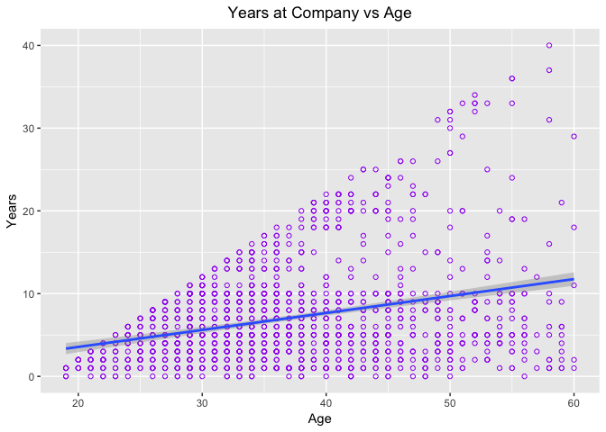<!-- -->

```r
hist(talentData$MonthlyIncm, col = "darkgreen", xlab="Monthly Income", main="Histogram of Monthly Income")
```

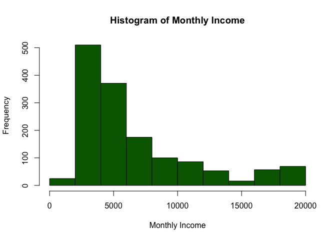<!-- -->

On the histograms we can see almost equal spread of hourly rates within the company, but we can not say the same about monthly income, it means that employees work different amount of hours (some of them are part time, and some of them work with overtime (more then 40hours), we do not have information if any bonuses were paid in the company, so it does not make sense to continue analyze working hours). Histogram of income shows a right skewed distribution for our Monthly Income in our dataset. It is also clear that the majority of the population in this dataset makes between \$1000 and $6000 per month. The higher we go out in income the more the distribution becomes narrower.

#### 3.C####

##### Understanding Gender, Education, & Occupations

Next we explore how Gender, Education and Job Role is broken down within our dataset. Below are frequency tables of our findings for these three categories...


```r
library(ggplot2)

demographics <- talentData[,c("JobRole", "Gender", "EduField")]

build_table <- function(column_name, title) {
  
   t <- as.data.frame(table(column_name))
    names(t) <- c(title, "Frequency")
      t %>% kable("html") %>% kable_styling(bootstrap_options = c("striped", "hover", "condensed", "responsive")) 

}

build_table(demographics$Gender, "Gender")
```

<table class="table table-striped table-hover table-condensed table-responsive" style="margin-left: auto; margin-right: auto;">
 <thead>
  <tr>
   <th style="text-align:left;"> Gender </th>
   <th style="text-align:right;"> Frequency </th>
  </tr>
 </thead>
<tbody>
  <tr>
   <td style="text-align:left;"> Female </td>
   <td style="text-align:right;"> 584 </td>
  </tr>
  <tr>
   <td style="text-align:left;"> Male </td>
   <td style="text-align:right;"> 878 </td>
  </tr>
</tbody>
</table>

```r
build_table(demographics$EduField, "Education")
```

<table class="table table-striped table-hover table-condensed table-responsive" style="margin-left: auto; margin-right: auto;">
 <thead>
  <tr>
   <th style="text-align:left;"> Education </th>
   <th style="text-align:right;"> Frequency </th>
  </tr>
 </thead>
<tbody>
  <tr>
   <td style="text-align:left;"> Human Resources </td>
   <td style="text-align:right;"> 27 </td>
  </tr>
  <tr>
   <td style="text-align:left;"> Life Sciences </td>
   <td style="text-align:right;"> 603 </td>
  </tr>
  <tr>
   <td style="text-align:left;"> Marketing </td>
   <td style="text-align:right;"> 158 </td>
  </tr>
  <tr>
   <td style="text-align:left;"> Medical </td>
   <td style="text-align:right;"> 460 </td>
  </tr>
  <tr>
   <td style="text-align:left;"> Other </td>
   <td style="text-align:right;"> 82 </td>
  </tr>
  <tr>
   <td style="text-align:left;"> Technical Degree </td>
   <td style="text-align:right;"> 132 </td>
  </tr>
</tbody>
</table>

```r
build_table(demographics$JobRole, "Job Role")
```

<table class="table table-striped table-hover table-condensed table-responsive" style="margin-left: auto; margin-right: auto;">
 <thead>
  <tr>
   <th style="text-align:left;"> Job Role </th>
   <th style="text-align:right;"> Frequency </th>
  </tr>
 </thead>
<tbody>
  <tr>
   <td style="text-align:left;"> Healthcare Representative </td>
   <td style="text-align:right;"> 131 </td>
  </tr>
  <tr>
   <td style="text-align:left;"> Human Resources </td>
   <td style="text-align:right;"> 52 </td>
  </tr>
  <tr>
   <td style="text-align:left;"> Laboratory Technician </td>
   <td style="text-align:right;"> 256 </td>
  </tr>
  <tr>
   <td style="text-align:left;"> Manager </td>
   <td style="text-align:right;"> 102 </td>
  </tr>
  <tr>
   <td style="text-align:left;"> Manufacturing Director </td>
   <td style="text-align:right;"> 145 </td>
  </tr>
  <tr>
   <td style="text-align:left;"> Research Director </td>
   <td style="text-align:right;"> 80 </td>
  </tr>
  <tr>
   <td style="text-align:left;"> Research Scientist </td>
   <td style="text-align:right;"> 290 </td>
  </tr>
  <tr>
   <td style="text-align:left;"> Sales Executive </td>
   <td style="text-align:right;"> 326 </td>
  </tr>
  <tr>
   <td style="text-align:left;"> Sales Representative </td>
   <td style="text-align:right;"> 80 </td>
  </tr>
</tbody>
</table>


Next, we examine the frequency for gender and how it is distributed across job roles visually.


```r
theme_set(theme_light())

ggplot(demographics, aes(demographics$JobRole)) + 
  geom_bar(aes(fill=Gender), width = 0.5) +
  labs(title = "Gender by Job Role",
       subtitle = "Men & Women in Specific JobRole",
       x = "Job Role",
       y = "Frequency") +
  coord_flip()
```

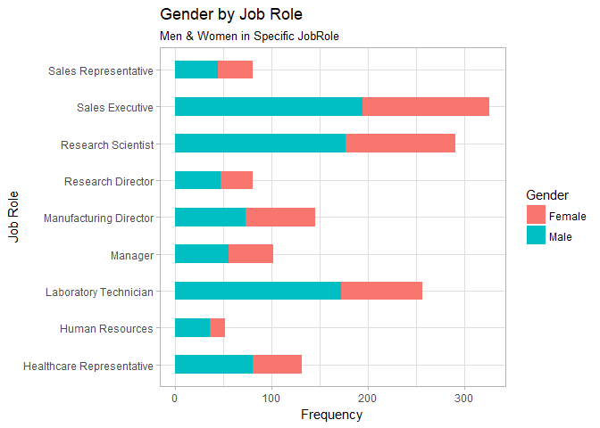<!-- -->

Our chart shows a bimodal distribution of our job roles. What is interesting here is we can see that sales executive is the most commonly occurring job in our dataset with more than 300 people represented in that category. It is also interesting to note that the spread between male and female in that job category looks almost equally represented. Our Lowest category is Human Resources Which has partitioned of mostly males even though there are just under 50 people in this category as a whole.

What about Education? How is education represented across the genders. We take a look at that distribution next.


```r
theme_set(theme_dark())

ggplot(demographics, aes(demographics$EduField)) + 
  geom_bar(aes(fill=Gender), width = 0.5) +
  labs(title = "Gender by Field Of Education",
       subtitle = "A breakdown in what fields of education was explored by the genders",
       x = "Field Of Study",
       y = "Frequency") +
  coord_flip()
```

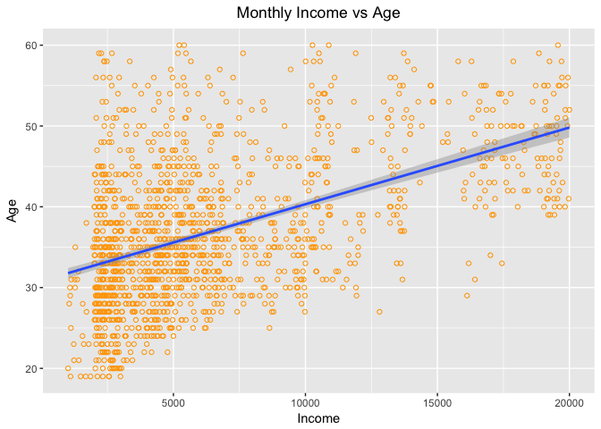<!-- -->

We can see from this chart that Human Resources has the lowest participation in terms of education which actually makes sense given that it is our lowest filled job role. Life Science seems to be the most popular field of study between all the listed education choices with 600 different people in our dataset who studied in this field. This does not necessarily match with our discovery regarding our popular job role. Life Science skills can translate into making great Sales Executives, but this educational field of study does not seem to be directly related to the Sales Executive.

#### 3.D####

Finally, we take a look at a frequency Table for all the different management positions.


```r
t <- droplevels(filter(demographics, JobRole == "Manager" | JobRole == "Manufacturing Director" | JobRole == "Research Director"))

build_table(t$JobRole, "ManagementOnly")
```

<table class="table table-striped table-hover table-condensed table-responsive" style="margin-left: auto; margin-right: auto;">
 <thead>
  <tr>
   <th style="text-align:left;"> ManagementOnly </th>
   <th style="text-align:right;"> Frequency </th>
  </tr>
 </thead>
<tbody>
  <tr>
   <td style="text-align:left;"> Manager </td>
   <td style="text-align:right;"> 102 </td>
  </tr>
  <tr>
   <td style="text-align:left;"> Manufacturing Director </td>
   <td style="text-align:right;"> 145 </td>
  </tr>
  <tr>
   <td style="text-align:left;"> Research Director </td>
   <td style="text-align:right;"> 80 </td>
  </tr>
</tbody>
</table>


Now that we have an overall view of our data now we can begin to try to answer our questions of interest regarding our dataset. Our questions of interest are simply the following...

1. What are the factors that lead to employee attrition?
2. Can employee attrition be slowed, or avoided all together?

Our next section will use all of our recent discoveries about the `talentData` to answer these inquiries.

## IV. Deeper Analysis and Visualization


When it comes to jobs the first thing that we want to look at is our age distribution. This is an important step in our EDA process as we would like to get an idea of how old or young our these individuals in our entire dataset as it might give us a good place to start. We are only interested in exploring individuals in the workforce that are older than 18, so all of the forward analysis will take this constraint into consideration.


```r
hist(talentData$Age, xlab= "Ages",
     ylab="Frequency Of Occurrence",
     main= "Age Distribution Frequency",
     col = "blue")
```

<!-- -->

Based on the chart above we can see that our age range is between 20 and 60 with a large portion of ages being between 25 and 45. This is insightful as it might help us with interpretation of our findings moving forward. It is also worth noting that  between 30 and 35  is the most occurring age of all the age groups with over 350 recorded ages within this group!

Another thing that we would like to explore is whether or not there is a relationship between our Ages and the number of years they have spent at a specific company. If there is a relationship, we would like to understand whether or not the relationship is positive or negatively correlated.


```r
library(ggplot2)
theme_set(theme_light())

ggplot(talentData, aes(x=Age, y=YrsAtCompany)) +
  ggtitle("Years at Company vs Age") +
  theme(plot.title = element_text(hjust = 0.5)) +
  labs(x= "Age", y="Years") +
  geom_point(shape=1, col = "purple") +
  geom_smooth(method = "gam")
```

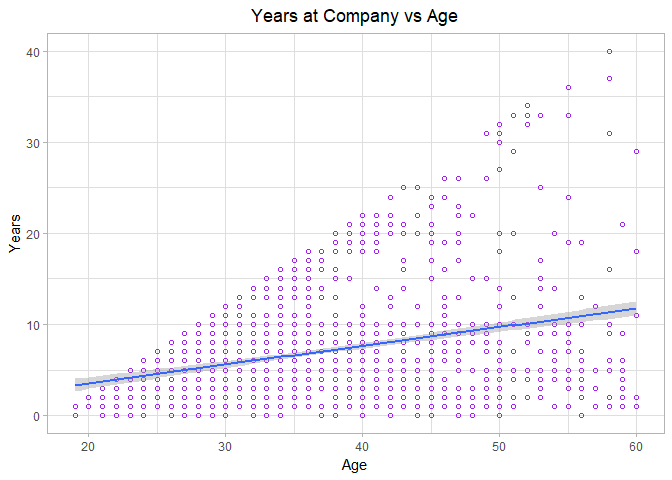<!-- -->

Our findings here are not surprising. We notice that visually there might be evidence of a positive linear relationship between age and years at a specific company. This finding suggests that the older you are the more likely you are to have a greater number of years at a specific company. To know for sure we examine Pearson correlation between `YrsAtCompany` and `Age`.


```r
cor.test(x=talentData$Age, y=talentData$YrsAtCompany,
         alternative = "two.sided",
         method="pearson",
         conf.level = 0.95,
         exact = TRUE)
```

```
## 
## 	Pearson's product-moment correlation
## 
## data:  talentData$Age and talentData$YrsAtCompany
## t = 12.148, df = 1460, p-value < 2.2e-16
## alternative hypothesis: true correlation is not equal to 0
## 95 percent confidence interval:
##  0.2556936 0.3488375
## sample estimates:
##      cor 
## 0.302989
```

Based on the results of our correlation test we have a Pearsons correlation value of `0.302989` (95% CI: 0.25 to 0.34) which is more evidence of a positive linear relationship between Age and Years at a specific company. It is important for us to keep this relationship in mind moving forward for the rest of the study.

#### Exploring the Relationship between Years At a the company and Satisfaction

Now that we know that Age, and Income have a positive impact on employee retention we would like to visually confirm our assumption that Job Satisfaction also contributes in a major way to someone remaining at a company. We can do this by examining our different levels of employee satisfaction and their Years they have remained at a particular company.


```r
ggplot(talentData, aes(YrsAtCompany)) +
  geom_density(aes(fill=JobSatfctn), alpha=0.8) +
  labs(title= "Years At the Company Density Plot",
       subtitle="Years at the Company grouped by Job Satisfaction",
       x="Years at Company",
       y="Density")
```

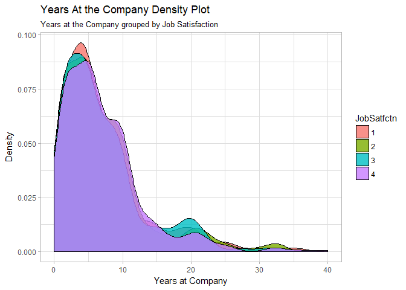<!-- -->

The Chart above is very telling. We take a look at our probability distribution across different Job Satisfaction levels. 1 indicates that there is low employee job satisfaction, and 4 represents that there is really high employee job satisfaction. If we examine the probability of each within the context of the years an individual stays at a company it becomes clear that lower job satisfaction indicates that this category has the lowest number of years spent at a company. This is no surprise, but it does give us more information regarding negative factors to employee attrition.

##### Correlation Plot of TalentData

In our data set there are a large number of numerical based values. We would like to get an idea of the relationship of those variables relate to one another in one glance. Below is a comprised chart of all the correlations regarding our talent data.


```r
library(ggcorrplot)
```

```
## Warning: package 'ggcorrplot' was built under R version 3.4.4
```

```r
continuous_vars <- talentData[, c("YrsWthCurMgr",
                                  "YrsSncLstPrn",
                                  "YrsInCrntRl",
                                  "YrsAtCompany",
                                  "TrngTmsLstYr",
                                  "TtlWrkngYrs",
                                  "PrcntSalHike",
                                  "MonthlyIncm",
                                  "HourlyRate",
                                  "DailyRate",
                                  "Age",
                                  "DistFromHome",
                                  "YrsOfEdu")]

correlations <- round(cor(continuous_vars), 1)

ggcorrplot(correlations, hc.order = TRUE,
           type = "lower",
           lab = TRUE,
           lab_size = 4,
           method="circle",
           colors= c("tomato2", "white", "springgreen3"),
           title = "Correlation Chart For TalentData",
           ggtheme=theme_bw)
```

<!-- -->

The chart above shows us that there are no negative linear relationships in our data between our variables. We can also see that there are some positive relationships between variables that are linearly correlated and we have now been able to narrow these down so they can be examined in depth.

### 4.C Let's check if there is any relationship between Age and Income. Does Gender makes any effect on the Monthly income?


```r
MonthlyIncm <- talentData$MonthlyIncm
Age <- talentData$Age
Gender <- talentData$Gender
ggplot(talentData, aes(MonthlyIncm, Age, color = Gender, shape=Gender))+geom_point()+ggtitle("Correlation between Monthly income and Ages")
```

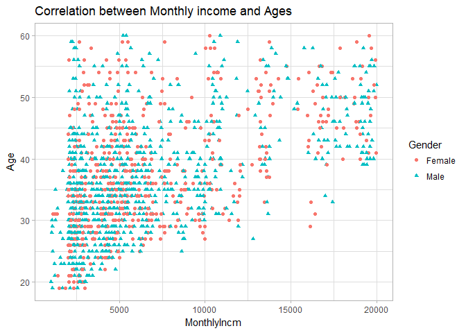<!-- -->

```r
model_AgeIncome <- lm(MonthlyIncm ~ Age+Gender, data = talentData)
summary(model_AgeIncome)
```

```
## 
## Call:
## lm(formula = MonthlyIncm ~ Age + Gender, data = talentData)
## 
## Residuals:
##     Min      1Q  Median      3Q     Max 
## -9927.2 -2623.9  -711.1  1817.3 12595.1 
## 
## Coefficients:
##             Estimate Std. Error t value Pr(>|t|)    
## (Intercept) -2872.67     475.14  -6.046 1.88e-09 ***
## Age           256.12      11.85  21.616  < 2e-16 ***
## GenderMale   -134.31     218.91  -0.614     0.54    
## ---
## Signif. codes:  0 '***' 0.001 '**' 0.01 '*' 0.05 '.' 0.1 ' ' 1
## 
## Residual standard error: 4096 on 1459 degrees of freedom
## Multiple R-squared:  0.2434,	Adjusted R-squared:  0.2424 
## F-statistic: 234.7 on 2 and 1459 DF,  p-value: < 2.2e-16
```
From regression analysis above we can say that Gender does not make significant change in the Monthly employee income. But Age is indeed significant variable (p<0.0001), it can explain 24% of monthly income change.


### 4D. What Factors Cause Employee Turnover?

Our goal is to determine which indicators might lead to employee attrition. The best way for us to find those is to create a regression model for Attrition prediction.

Let's use stepwise selection method to come up with the model which has only significant variables.


```r
library(MASS)
```

```
## 
## Attaching package: 'MASS'
```

```
## The following object is masked from 'package:dplyr':
## 
##     select
```

```r
full<- glm(Attrition~Age+BusinessTrvl+DailyRate+Department+DistFromHome+YrsOfEdu+EduField	+EnvSatfctn+Gender+HourlyRate+JobInvolmnt+JobLevel+JobRole+JobSatfctn+MaritalStat+MonthlyIncm+MonthlyRate+ NumCmpWorked+OverTime+PrcntSalHike+PerfRating+RlnSatfctn+StockOptLvl+TtlWrkngYrs+TrngTmsLstYr+WrkLifeBal+	YrsAtCompany+YrsInCrntRl+YrsSncLstPrn+YrsWthCurMgr, family = binomial, data=talentData)
step<- stepAIC(full,trace=FALSE)
step$anova
```

```
## Stepwise Model Path 
## Analysis of Deviance Table
## 
## Initial Model:
## Attrition ~ Age + BusinessTrvl + DailyRate + Department + DistFromHome + 
##     YrsOfEdu + EduField + EnvSatfctn + Gender + HourlyRate + 
##     JobInvolmnt + JobLevel + JobRole + JobSatfctn + MaritalStat + 
##     MonthlyIncm + MonthlyRate + NumCmpWorked + OverTime + PrcntSalHike + 
##     PerfRating + RlnSatfctn + StockOptLvl + TtlWrkngYrs + TrngTmsLstYr + 
##     WrkLifeBal + YrsAtCompany + YrsInCrntRl + YrsSncLstPrn + 
##     YrsWthCurMgr
## 
## Final Model:
## Attrition ~ Age + BusinessTrvl + DailyRate + DistFromHome + EduField + 
##     EnvSatfctn + Gender + JobInvolmnt + JobLevel + JobRole + 
##     JobSatfctn + NumCmpWorked + OverTime + RlnSatfctn + StockOptLvl + 
##     TtlWrkngYrs + TrngTmsLstYr + WrkLifeBal + YrsAtCompany + 
##     YrsInCrntRl + YrsSncLstPrn + YrsWthCurMgr
## 
## 
##             Step Df   Deviance Resid. Df Resid. Dev      AIC
## 1                                   1402   767.0627 887.0627
## 2   - PerfRating  1 0.08283707      1403   767.1455 885.1455
## 3 - PrcntSalHike  1 0.19333621      1404   767.3389 883.3389
## 4  - MaritalStat  2 2.29885387      1406   769.6377 881.6377
## 5   - Department  2 2.15967994      1408   771.7974 879.7974
## 6  - MonthlyRate  1 0.30982273      1409   772.1072 878.1072
## 7     - YrsOfEdu  1 0.49508930      1410   772.6023 876.6023
## 8   - HourlyRate  1 0.62593017      1411   773.2282 875.2282
## 9  - MonthlyIncm  1 1.72608005      1412   774.9543 874.9543
```

```r
StepwiseModel_Attrition <- glm(Attrition ~ Age + BusinessTrvl + DailyRate + DistFromHome + EduField + 
    EnvSatfctn + Gender + JobInvolmnt + JobLevel + JobRole + 
    JobSatfctn + NumCmpWorked + OverTime + RlnSatfctn + StockOptLvl + 
    TtlWrkngYrs + TrngTmsLstYr + WrkLifeBal + YrsAtCompany + 
    YrsInCrntRl + YrsSncLstPrn + YrsWthCurMgr, family = binomial, data=talentData)
summary(StepwiseModel_Attrition)
```

```
## 
## Call:
## glm(formula = Attrition ~ Age + BusinessTrvl + DailyRate + DistFromHome + 
##     EduField + EnvSatfctn + Gender + JobInvolmnt + JobLevel + 
##     JobRole + JobSatfctn + NumCmpWorked + OverTime + RlnSatfctn + 
##     StockOptLvl + TtlWrkngYrs + TrngTmsLstYr + WrkLifeBal + YrsAtCompany + 
##     YrsInCrntRl + YrsSncLstPrn + YrsWthCurMgr, family = binomial, 
##     data = talentData)
## 
## Deviance Residuals: 
##     Min       1Q   Median       3Q      Max  
## -1.7445  -0.4451  -0.2018  -0.0622   3.4579  
## 
## Coefficients:
##                                 Estimate Std. Error z value Pr(>|z|)    
## (Intercept)                    3.6181563  1.2706264   2.848 0.004406 ** 
## Age                           -0.0260159  0.0141398  -1.840 0.065781 .  
## BusinessTrvlTravel_Frequently  2.2155197  0.4504153   4.919 8.71e-07 ***
## BusinessTrvlTravel_Rarely      1.1947786  0.4150545   2.879 0.003994 ** 
## DailyRate                     -0.0004036  0.0002330  -1.733 0.083178 .  
## DistFromHome                   0.0565932  0.0115241   4.911 9.07e-07 ***
## EduFieldLife Sciences         -0.7714993  0.8046792  -0.959 0.337676    
## EduFieldMarketing             -0.2933875  0.8518262  -0.344 0.730529    
## EduFieldMedical               -0.7990737  0.8063506  -0.991 0.321698    
## EduFieldOther                 -0.7016476  0.8824394  -0.795 0.426542    
## EduFieldTechnical Degree       0.3523726  0.8278938   0.426 0.670381    
## EnvSatfctn2                   -1.1018306  0.2921475  -3.771 0.000162 ***
## EnvSatfctn3                   -1.2434005  0.2695765  -4.612 3.98e-06 ***
## EnvSatfctn4                   -1.3715407  0.2689086  -5.100 3.39e-07 ***
## GenderMale                     0.3754770  0.1951634   1.924 0.054366 .  
## JobInvolmnt2                  -1.1922220  0.3705098  -3.218 0.001292 ** 
## JobInvolmnt3                  -1.5416306  0.3499986  -4.405 1.06e-05 ***
## JobInvolmnt4                  -2.1188441  0.4823939  -4.392 1.12e-05 ***
## JobLevel2                     -1.6674659  0.4475994  -3.725 0.000195 ***
## JobLevel3                     -0.4012516  0.5658105  -0.709 0.478224    
## JobLevel4                     -1.6470379  0.9884982  -1.666 0.095673 .  
## JobLevel5                      0.7434310  1.2848912   0.579 0.562863    
## JobRoleHuman Resources         0.5335634  0.7531066   0.708 0.478645    
## JobRoleLaboratory Technician   0.7308250  0.5930632   1.232 0.217841    
## JobRoleManager                -0.9794199  1.0253470  -0.955 0.339472    
## JobRoleManufacturing Director  0.4472787  0.5610328   0.797 0.425311    
## JobRoleResearch Director      -2.1787101  1.0751884  -2.026 0.042729 *  
## JobRoleResearch Scientist     -0.3235446  0.6129802  -0.528 0.597623    
## JobRoleSales Executive         1.3251283  0.4753929   2.787 0.005313 ** 
## JobRoleSales Representative    1.3392198  0.6642588   2.016 0.043788 *  
## JobSatfctn2                   -0.6838494  0.2862798  -2.389 0.016906 *  
## JobSatfctn3                   -0.6777859  0.2538438  -2.670 0.007583 ** 
## JobSatfctn4                   -1.2901946  0.2699270  -4.780 1.75e-06 ***
## NumCmpWorked                   0.2101087  0.0410569   5.117 3.10e-07 ***
## OverTimeYes                    2.1658772  0.2095253  10.337  < 2e-16 ***
## RlnSatfctn2                   -0.9841531  0.2974752  -3.308 0.000938 ***
## RlnSatfctn3                   -1.0310791  0.2678812  -3.849 0.000119 ***
## RlnSatfctn4                   -1.0356753  0.2682320  -3.861 0.000113 ***
## StockOptLvl1                  -1.4613095  0.2185146  -6.687 2.27e-11 ***
## StockOptLvl2                  -1.4527612  0.3754485  -3.869 0.000109 ***
## StockOptLvl3                  -0.7644229  0.4069912  -1.878 0.060350 .  
## TtlWrkngYrs                   -0.0688767  0.0306138  -2.250 0.024458 *  
## TrngTmsLstYr                  -0.1707231  0.0762054  -2.240 0.025071 *  
## WrkLifeBal2                   -0.9765924  0.3870782  -2.523 0.011636 *  
## WrkLifeBal3                   -1.5026213  0.3646337  -4.121 3.77e-05 ***
## WrkLifeBal4                   -1.0953274  0.4412842  -2.482 0.013060 *  
## YrsAtCompany                   0.0988123  0.0427345   2.312 0.020765 *  
## YrsInCrntRl                   -0.1460829  0.0511317  -2.857 0.004277 ** 
## YrsSncLstPrn                   0.1664042  0.0454302   3.663 0.000249 ***
## YrsWthCurMgr                  -0.1413055  0.0504870  -2.799 0.005128 ** 
## ---
## Signif. codes:  0 '***' 0.001 '**' 0.01 '*' 0.05 '.' 0.1 ' ' 1
## 
## (Dispersion parameter for binomial family taken to be 1)
## 
##     Null deviance: 1282.54  on 1461  degrees of freedom
## Residual deviance:  774.95  on 1412  degrees of freedom
## AIC: 874.95
## 
## Number of Fisher Scoring iterations: 7
```

```r
CustomModel_Attrition <- glm(Attrition ~ BusinessTrvl + DistFromHome + 
    EnvSatfctn + JobInvolmnt + 
    JobSatfctn + NumCmpWorked + OverTime + RlnSatfctn + 
    TtlWrkngYrs + WrkLifeBal + YrsAtCompany + 
    YrsInCrntRl + YrsSncLstPrn + YrsWthCurMgr, family = binomial, data=talentData)
summary(CustomModel_Attrition)
```

```
## 
## Call:
## glm(formula = Attrition ~ BusinessTrvl + DistFromHome + EnvSatfctn + 
##     JobInvolmnt + JobSatfctn + NumCmpWorked + OverTime + RlnSatfctn + 
##     TtlWrkngYrs + WrkLifeBal + YrsAtCompany + YrsInCrntRl + YrsSncLstPrn + 
##     YrsWthCurMgr, family = binomial, data = talentData)
## 
## Deviance Residuals: 
##     Min       1Q   Median       3Q      Max  
## -1.9744  -0.5218  -0.3133  -0.1402   3.5586  
## 
## Coefficients:
##                                Estimate Std. Error z value Pr(>|z|)    
## (Intercept)                    1.372745   0.609779   2.251 0.024372 *  
## BusinessTrvlTravel_Frequently  1.947783   0.402503   4.839 1.30e-06 ***
## BusinessTrvlTravel_Rarely      1.139439   0.376812   3.024 0.002495 ** 
## DistFromHome                   0.039682   0.009983   3.975 7.03e-05 ***
## EnvSatfctn2                   -1.069100   0.260644  -4.102 4.10e-05 ***
## EnvSatfctn3                   -1.121141   0.232287  -4.827 1.39e-06 ***
## EnvSatfctn4                   -1.214059   0.234053  -5.187 2.14e-07 ***
## JobInvolmnt2                  -1.085428   0.327927  -3.310 0.000933 ***
## JobInvolmnt3                  -1.532624   0.311002  -4.928 8.31e-07 ***
## JobInvolmnt4                  -2.140413   0.437132  -4.896 9.76e-07 ***
## JobSatfctn2                   -0.590929   0.253570  -2.330 0.019783 *  
## JobSatfctn3                   -0.677072   0.224069  -3.022 0.002514 ** 
## JobSatfctn4                   -1.293745   0.243731  -5.308 1.11e-07 ***
## NumCmpWorked                   0.157428   0.035645   4.416 1.00e-05 ***
## OverTimeYes                    1.791276   0.177999  10.063  < 2e-16 ***
## RlnSatfctn2                   -0.725094   0.259866  -2.790 0.005267 ** 
## RlnSatfctn3                   -0.688730   0.233335  -2.952 0.003161 ** 
## RlnSatfctn4                   -0.888801   0.240851  -3.690 0.000224 ***
## TtlWrkngYrs                   -0.129640   0.021205  -6.114 9.74e-10 ***
## WrkLifeBal2                   -0.938501   0.331982  -2.827 0.004699 ** 
## WrkLifeBal3                   -1.188394   0.307358  -3.866 0.000110 ***
## WrkLifeBal4                   -0.791590   0.378381  -2.092 0.036435 *  
## YrsAtCompany                   0.079836   0.036210   2.205 0.027467 *  
## YrsInCrntRl                   -0.123868   0.043254  -2.864 0.004186 ** 
## YrsSncLstPrn                   0.153451   0.039009   3.934 8.36e-05 ***
## YrsWthCurMgr                  -0.113428   0.044172  -2.568 0.010233 *  
## ---
## Signif. codes:  0 '***' 0.001 '**' 0.01 '*' 0.05 '.' 0.1 ' ' 1
## 
## (Dispersion parameter for binomial family taken to be 1)
## 
##     Null deviance: 1282.5  on 1461  degrees of freedom
## Residual deviance:  944.9  on 1436  degrees of freedom
## AIC: 996.9
## 
## Number of Fisher Scoring iterations: 6
```
AIC of the StepwiseModel is 874.95 and R is 1 - (Residual Deviance/Null Deviance)= 1 - 774.95/1285.54 = 0.4. 
AIC of the CustomModel is 996.9 and R is 1 - (Residual Deviance/Null Deviance)= 1 - 944.9/1285.54 = 0.26.

Model assumptions:
Logistic regression does not make many of the key assumptions of linear regression and general linear models that are based on ordinary least squares algorithms particularly regarding linearity, normality, homoscedasticity, and measurement level.
First, binary logistic regression requires the dependent variable to be binary - Assumption is met.
Second, logistic regression requires the observations to be independent of each other.  In other words, the observations should not come from repeated measurements or matched data - Assumption is met.
Third, logistic regression requires there to be little or no multicollinearity among the independent variables.  This means that the independent variables should not be too highly correlated with each other - Assumption is met.
Fourth, logistic regression assumes linearity of independent variables - Assumption is met.
Finally, logistic regression typically requires a large sample size - Assumption is met (1470 observations).

#####Interpretation of Stepwise Model
We definitely see that Stepwise Model is more predictive. Let's pick the most significant variables that may effect on attrition (positive slope will indicate increasing of attrition chance additively):

- Increasing of Overtime by 1 hour may predict that average attrition possibility will increase by 2.16
- BusinessTrvlTravel_Frequently may predict that average attrition possibility will increase by 2.22
- BusinessTrvlTravel_Rarely may predict that average attrition possibility will increase by 1.19
- Increasing of DistFromHome for 1 mile (assuming that distance were given in miles) may predict that average attrition possibility will increase by 0.06
- If employee has Job role Sales Executive we may predict that average attrition possibility will increase by 1.32
- If employee has Job role Sales Representative we may predict that average attrition possibility will increase by 1.34
- If number of companies where an employee worked increases by 1, we may predict that average attrition possibility will increase by 0.2
- Increasing of Years after last Promotion by 1 year may predict that average attrition possibility will increase by 0.16


```r
variables<-c("Overtime","BusinessTrvlTravel_Frequently", "BusinessTrvlTravel_Rarely", "DistFromHome", "NumCmpWorked", "YrsSncLstPrn")
Effect<-c(2.16, 2.22, 1.19, 0.06, 0.2,0.16)
df <- data.frame(variables,Effect)
mytheme <- theme(plot.title = element_text(face = "bold.italic",size= 14, color = "black"), axis.text.x = element_text(face ="bold.italic"), axis.text.y = element_text(face = "bold.italic", size = 7))
df$variables <- factor(variables, levels = df$variables[order(df$Effect)])
ggplot(data = df, aes(x = df$variables, y = df$Effect), horis=TRUE)+geom_bar(stat = "identity", fill="#FF9999")+labs(title = "Attrition influential factors", x="Variables",y="Influential Percent")+mytheme+coord_flip()
```

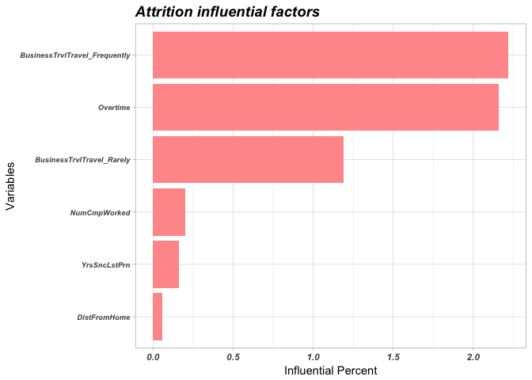<!-- -->

As we can see from the histogram above, the most influential factors for Attrition are Business Travels and Overtime. Let's see Overtime and Business Travels by Attrition factors on histograms and confirm this conclusion with actual percentage.


```r
ggplot(talentData,aes(x=OverTime,fill = Attrition))+geom_bar()+ggtitle("Attrition based on Overtime factors")  +labs(x = "OverTime", y = "Count")
```

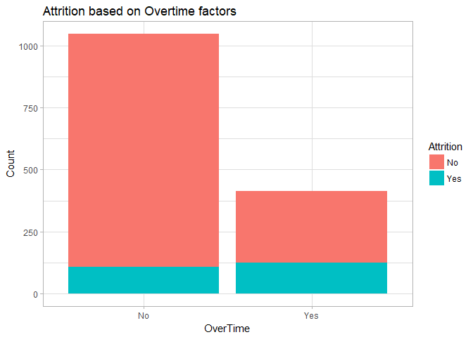<!-- -->

```r
library(kableExtra)
mytable1 <- xtabs(~OverTime+Attrition, data = talentData)
tabl1<- data.frame(ftable(mytable1))
percent11<- tabl1[3,3]/tabl1[1,3]*100
percent12<- tabl1[4,3]/tabl1[2,3]*100
Attrition_Percent <-round(c(0,0,percent11,percent12),2)
df1 <- data.frame(tabl1,Attrition_Percent)
df1 %>%
  kable("html") %>%
  kable_styling() %>%
  row_spec(4, bold = T, color = "white", background = "#D7261E")
```

<table class="table" style="margin-left: auto; margin-right: auto;">
 <thead>
  <tr>
   <th style="text-align:left;"> OverTime </th>
   <th style="text-align:left;"> Attrition </th>
   <th style="text-align:right;"> Freq </th>
   <th style="text-align:right;"> Attrition_Percent </th>
  </tr>
 </thead>
<tbody>
  <tr>
   <td style="text-align:left;"> No </td>
   <td style="text-align:left;"> No </td>
   <td style="text-align:right;"> 940 </td>
   <td style="text-align:right;"> 0.00 </td>
  </tr>
  <tr>
   <td style="text-align:left;"> Yes </td>
   <td style="text-align:left;"> No </td>
   <td style="text-align:right;"> 289 </td>
   <td style="text-align:right;"> 0.00 </td>
  </tr>
  <tr>
   <td style="text-align:left;"> No </td>
   <td style="text-align:left;"> Yes </td>
   <td style="text-align:right;"> 108 </td>
   <td style="text-align:right;"> 11.49 </td>
  </tr>
  <tr>
   <td style="text-align:left;font-weight: bold;color: white;background-color: #D7261E;"> Yes </td>
   <td style="text-align:left;font-weight: bold;color: white;background-color: #D7261E;"> Yes </td>
   <td style="text-align:right;font-weight: bold;color: white;background-color: #D7261E;"> 125 </td>
   <td style="text-align:right;font-weight: bold;color: white;background-color: #D7261E;"> 43.25 </td>
  </tr>
</tbody>
</table>
Attrition rate within employees with OverTime is 43.25%. It is 276% higher then attrition rate within employees without Overtime working hours.


```r
ggplot(talentData,aes(x=BusinessTrvl,fill = Attrition))+geom_bar()+ggtitle("Attrition based on Business Travel factors")  +labs(x = "Business Travel", y = "Count")
```

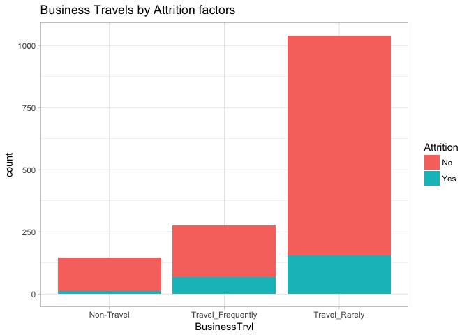<!-- -->

```r
mytable2 <- xtabs(~BusinessTrvl+Attrition, data = talentData)
tabl2<- data.frame(ftable(mytable2))
percent21<- tabl2[4,3]/tabl2[1,3]*100
percent22<- tabl2[5,3]/tabl2[2,3]*100
percent23<- tabl2[6,3]/tabl2[3,3]*100
Attrition_Percent <-round(c(0,0,0,percent21,percent22,percent23),2)
df2 <- data.frame(tabl2,Attrition_Percent)
df2 %>%
  kable("html") %>%
  kable_styling() %>%
  row_spec(5:6, bold = T, color = "white", background = "#D7261E")
```

<table class="table" style="margin-left: auto; margin-right: auto;">
 <thead>
  <tr>
   <th style="text-align:left;"> BusinessTrvl </th>
   <th style="text-align:left;"> Attrition </th>
   <th style="text-align:right;"> Freq </th>
   <th style="text-align:right;"> Attrition_Percent </th>
  </tr>
 </thead>
<tbody>
  <tr>
   <td style="text-align:left;"> Non-Travel </td>
   <td style="text-align:left;"> No </td>
   <td style="text-align:right;"> 135 </td>
   <td style="text-align:right;"> 0.00 </td>
  </tr>
  <tr>
   <td style="text-align:left;"> Travel_Frequently </td>
   <td style="text-align:left;"> No </td>
   <td style="text-align:right;"> 208 </td>
   <td style="text-align:right;"> 0.00 </td>
  </tr>
  <tr>
   <td style="text-align:left;"> Travel_Rarely </td>
   <td style="text-align:left;"> No </td>
   <td style="text-align:right;"> 886 </td>
   <td style="text-align:right;"> 0.00 </td>
  </tr>
  <tr>
   <td style="text-align:left;"> Non-Travel </td>
   <td style="text-align:left;"> Yes </td>
   <td style="text-align:right;"> 11 </td>
   <td style="text-align:right;"> 8.15 </td>
  </tr>
  <tr>
   <td style="text-align:left;font-weight: bold;color: white;background-color: #D7261E;"> Travel_Frequently </td>
   <td style="text-align:left;font-weight: bold;color: white;background-color: #D7261E;"> Yes </td>
   <td style="text-align:right;font-weight: bold;color: white;background-color: #D7261E;"> 67 </td>
   <td style="text-align:right;font-weight: bold;color: white;background-color: #D7261E;"> 32.21 </td>
  </tr>
  <tr>
   <td style="text-align:left;font-weight: bold;color: white;background-color: #D7261E;"> Travel_Rarely </td>
   <td style="text-align:left;font-weight: bold;color: white;background-color: #D7261E;"> Yes </td>
   <td style="text-align:right;font-weight: bold;color: white;background-color: #D7261E;"> 155 </td>
   <td style="text-align:right;font-weight: bold;color: white;background-color: #D7261E;"> 17.49 </td>
  </tr>
</tbody>
</table>
Attrition rate within employees who has Frequent Business Travels is 32.21%, and 17.49% for those who has Rarely Business Travels. It is 295% and 114% higher then the attrition rate within NON travel employees, in respect to Frequent and Rarely Business Travels.

Please see below a histogram with variables that may have a good affect for "Long stay" employees, those who are satisfied with their working position and do not want to quit.


```r
variables<-c("EnvSatfctn2","EnvSatfctn3", "EnvSatfctn4", "JobInvolmnt2", "JobInvolmnt3", "JobInvolmnt4",
             "JobSatfctn3","JobSatfctn4", "RlnSatfctn2", "RlnSatfctn3", "RlnSatfctn4", "StockOptLvl1",
             "StockOptLvl2","WrkLifeBal3", "YrsWthCurMgr", "TrngTmsLstYr")
Effect<-c(-1.10, -1.24, -1.37,  -1.19, -1.54,-2.11, -0.67, -1.29,  -0.98,  -1.03,  -1.03,  -1.46,  -1.45, -1.5, -0.14, -0.17)
df <- data.frame(variables,Effect)
mytheme <- theme(plot.title = element_text(face = "bold.italic",size= 14, color = "black"), axis.text.x = element_text(face ="bold.italic"), axis.text.y = element_text(face = "bold.italic", size = 7))
df$variables <- factor(variables, levels = df$variables[order(df$Effect)])
ggplot(data = df, aes(x = df$variables, y = df$Effect), horis=TRUE)+geom_bar(stat = "identity", fill="#66CC99")+labs(title = "'Long stay' influential factors", x="Variables",y="Influential Percent")+mytheme+coord_flip()
```

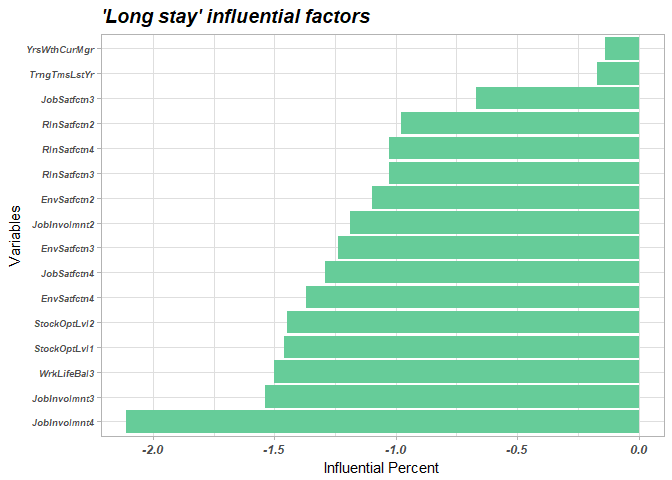<!-- -->

Lets confirm our findings with actual numbers.


```r
ggplot(talentData,aes(x=JobInvolmnt,fill = Attrition))+geom_bar()+ggtitle("Attrition based on Job Involvement factors") +labs(x = "Job Involvement level", y = "Count")
```

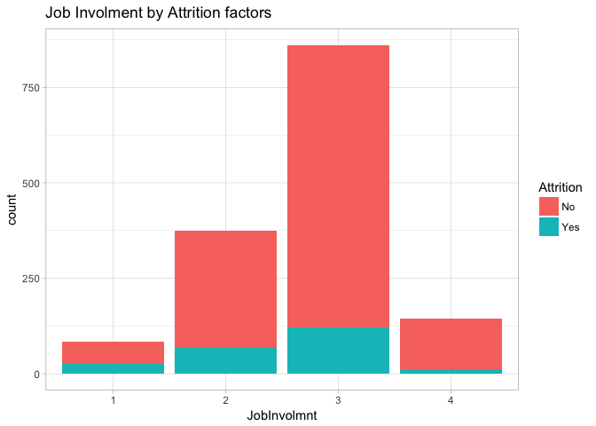<!-- -->

```r
mytable3 <- xtabs(~JobInvolmnt+Attrition, data = talentData)
tabl3<- data.frame(ftable(mytable3))
tabl3
```

```
##   JobInvolmnt Attrition Freq
## 1           1        No   55
## 2           2        No  303
## 3           3        No  740
## 4           4        No  131
## 5           1       Yes   28
## 6           2       Yes   71
## 7           3       Yes  121
## 8           4       Yes   13
```

```r
percent31<- tabl3[5,3]/tabl3[1,3]*100
percent32<- tabl3[6,3]/tabl3[2,3]*100
percent33<- tabl3[7,3]/tabl3[3,3]*100
percent34<- tabl3[8,3]/tabl3[4,3]*100
Attrition_Percent <-round(c(0,0,0,0,percent31,percent32,percent33,percent34),2)
df3 <- data.frame(tabl3,Attrition_Percent)
df3 %>%
  kable("html") %>%
  kable_styling() %>%
  row_spec(7:8, bold = T, color = "white", background = "#66CC99")
```

<table class="table" style="margin-left: auto; margin-right: auto;">
 <thead>
  <tr>
   <th style="text-align:left;"> JobInvolmnt </th>
   <th style="text-align:left;"> Attrition </th>
   <th style="text-align:right;"> Freq </th>
   <th style="text-align:right;"> Attrition_Percent </th>
  </tr>
 </thead>
<tbody>
  <tr>
   <td style="text-align:left;"> 1 </td>
   <td style="text-align:left;"> No </td>
   <td style="text-align:right;"> 55 </td>
   <td style="text-align:right;"> 0.00 </td>
  </tr>
  <tr>
   <td style="text-align:left;"> 2 </td>
   <td style="text-align:left;"> No </td>
   <td style="text-align:right;"> 303 </td>
   <td style="text-align:right;"> 0.00 </td>
  </tr>
  <tr>
   <td style="text-align:left;"> 3 </td>
   <td style="text-align:left;"> No </td>
   <td style="text-align:right;"> 740 </td>
   <td style="text-align:right;"> 0.00 </td>
  </tr>
  <tr>
   <td style="text-align:left;"> 4 </td>
   <td style="text-align:left;"> No </td>
   <td style="text-align:right;"> 131 </td>
   <td style="text-align:right;"> 0.00 </td>
  </tr>
  <tr>
   <td style="text-align:left;"> 1 </td>
   <td style="text-align:left;"> Yes </td>
   <td style="text-align:right;"> 28 </td>
   <td style="text-align:right;"> 50.91 </td>
  </tr>
  <tr>
   <td style="text-align:left;"> 2 </td>
   <td style="text-align:left;"> Yes </td>
   <td style="text-align:right;"> 71 </td>
   <td style="text-align:right;"> 23.43 </td>
  </tr>
  <tr>
   <td style="text-align:left;font-weight: bold;color: white;background-color: #66CC99;"> 3 </td>
   <td style="text-align:left;font-weight: bold;color: white;background-color: #66CC99;"> Yes </td>
   <td style="text-align:right;font-weight: bold;color: white;background-color: #66CC99;"> 121 </td>
   <td style="text-align:right;font-weight: bold;color: white;background-color: #66CC99;"> 16.35 </td>
  </tr>
  <tr>
   <td style="text-align:left;font-weight: bold;color: white;background-color: #66CC99;"> 4 </td>
   <td style="text-align:left;font-weight: bold;color: white;background-color: #66CC99;"> Yes </td>
   <td style="text-align:right;font-weight: bold;color: white;background-color: #66CC99;"> 13 </td>
   <td style="text-align:right;font-weight: bold;color: white;background-color: #66CC99;"> 9.92 </td>
  </tr>
</tbody>
</table>
Average Attrition rate for those who has Job Involvement level "high" and "very high" is smaller by 50% comparing with those who has Job Involvement level "low" and "medium". 


```r
ggplot(talentData,aes(x=StockOptLvl,fill = Attrition))+geom_bar()+ggtitle("Attrition based on Stock Option factors") +labs(x = "Stock Option Level", y = "Count")
```

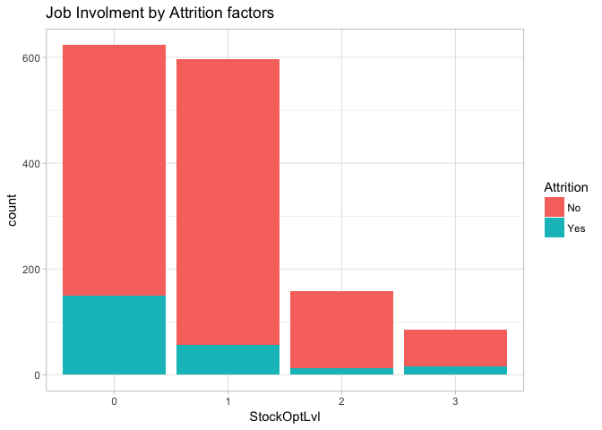<!-- -->

```r
mytable4 <- xtabs(~StockOptLvl+Attrition, data = talentData)
tabl4<- data.frame(ftable(mytable4))
tabl4
```

```
##   StockOptLvl Attrition Freq
## 1           0        No  473
## 2           1        No  540
## 3           2        No  146
## 4           3        No   70
## 5           0       Yes  150
## 6           1       Yes   56
## 7           2       Yes   12
## 8           3       Yes   15
```

```r
percent41<- tabl4[5,3]/tabl4[1,3]*100
percent42<- tabl4[6,3]/tabl4[2,3]*100
percent43<- tabl4[7,3]/tabl4[3,3]*100
percent44<- tabl4[8,3]/tabl4[4,3]*100
Attrition_Percent <-round(c(0,0,0,0,percent41,percent42,percent43,percent44),2)
df4 <- data.frame(tabl4,Attrition_Percent)
df4 %>%
  kable("html") %>%
  kable_styling() %>%
  row_spec(6:7, bold = T, color = "white", background = "#66CC99")
```

<table class="table" style="margin-left: auto; margin-right: auto;">
 <thead>
  <tr>
   <th style="text-align:left;"> StockOptLvl </th>
   <th style="text-align:left;"> Attrition </th>
   <th style="text-align:right;"> Freq </th>
   <th style="text-align:right;"> Attrition_Percent </th>
  </tr>
 </thead>
<tbody>
  <tr>
   <td style="text-align:left;"> 0 </td>
   <td style="text-align:left;"> No </td>
   <td style="text-align:right;"> 473 </td>
   <td style="text-align:right;"> 0.00 </td>
  </tr>
  <tr>
   <td style="text-align:left;"> 1 </td>
   <td style="text-align:left;"> No </td>
   <td style="text-align:right;"> 540 </td>
   <td style="text-align:right;"> 0.00 </td>
  </tr>
  <tr>
   <td style="text-align:left;"> 2 </td>
   <td style="text-align:left;"> No </td>
   <td style="text-align:right;"> 146 </td>
   <td style="text-align:right;"> 0.00 </td>
  </tr>
  <tr>
   <td style="text-align:left;"> 3 </td>
   <td style="text-align:left;"> No </td>
   <td style="text-align:right;"> 70 </td>
   <td style="text-align:right;"> 0.00 </td>
  </tr>
  <tr>
   <td style="text-align:left;"> 0 </td>
   <td style="text-align:left;"> Yes </td>
   <td style="text-align:right;"> 150 </td>
   <td style="text-align:right;"> 31.71 </td>
  </tr>
  <tr>
   <td style="text-align:left;font-weight: bold;color: white;background-color: #66CC99;"> 1 </td>
   <td style="text-align:left;font-weight: bold;color: white;background-color: #66CC99;"> Yes </td>
   <td style="text-align:right;font-weight: bold;color: white;background-color: #66CC99;"> 56 </td>
   <td style="text-align:right;font-weight: bold;color: white;background-color: #66CC99;"> 10.37 </td>
  </tr>
  <tr>
   <td style="text-align:left;font-weight: bold;color: white;background-color: #66CC99;"> 2 </td>
   <td style="text-align:left;font-weight: bold;color: white;background-color: #66CC99;"> Yes </td>
   <td style="text-align:right;font-weight: bold;color: white;background-color: #66CC99;"> 12 </td>
   <td style="text-align:right;font-weight: bold;color: white;background-color: #66CC99;"> 8.22 </td>
  </tr>
  <tr>
   <td style="text-align:left;"> 3 </td>
   <td style="text-align:left;"> Yes </td>
   <td style="text-align:right;"> 15 </td>
   <td style="text-align:right;"> 21.43 </td>
  </tr>
</tbody>
</table>
It is very interesting that employees prefer Stock Opt Level 1 and 2 verses Stock Opt Level 0 and 3. Average attrition rate is smaller by 67.5% for those who has Stock Opt Level 1 and 2.

## V. Discussion And Conclusions

After extensive statistical analysis we have been able to conclude that there are indeed several factors that lead to the attrition of employees. Based on what these factors are there are things the business can do to make it much harder for someone to decide if they want to leave a company. We have compiled a list of recommendations that DDSAnalytics can follow to help reduce Attrition. It should be stated that the following factors below will not guarantee employee Attrition will stop, but it will increase the chances of slowing Attrition at an organization.

#### Limit Business Travel

We found that Frequent business travel was a major contributor to churn in the dataset. If a company wants to reduce the the chances of someone wanting to leave a specific job they should make sure that worker has a reduced responsibility to travel as it could make all the difference in deciding whether to change companies.

#### Understand How workers feel about Overtime

We found that Not having overtime was very significant in determining employee attrition. This might indicate that management should limit the amount of times they ask employees to pick up extra hours, or only consider asking those that need the extra hours for personal reasons. This can go a long way into contributing to employee attrition.

#### Consider Remote Work

Based on studying the significance of the distance traveled from home to get to work i.e. commuting we found that this is an extremely significant factor. Based on a 95% confidence Interval the optimal distance is somewhere between 2 miles to 6 miles. If an employee has to travel more than that one should consider offering a remote option in order to limit attrition due to the Distance from Home.

#### Consider Hiring people that worked for less number of Companies

After studying the data we found that the ideal number of companies worked for those that did experience  attrition was 1 to 3 companies on a 95% confidence interval. This indicates that people that work for multiple companies are more likely to contribute to the Attrition rate. This is an extreme solution, but one should consider the amount of companies a potential employee worked before hiring them, as it might be a key predictor as to whether or not that individual will stay or leave.

#### Satisfaction Indicators

We found that Job Involvement Level 4 ("very high") and 3 ("high"), Environment Satisfaction, Job Satisfaction Level 4 ("very high"), Stock Option Levels 1 and 2 are all contributed to employee churn in a major way. This indicates that management should consider doing things to make the work environment more comfortable so that the employees feel great about going to work every day. Employees also need to feel heavily involved in their job in as well as be satisfied doing it. It is important to conduct reviews and surveys to find out how employees feel in these areas so that an overall general pulse can be gathered on how the company is performing here.

#### Work relationships must be maintained

Employees consider work relationships to be an extremely important factor and it also contributes to employee "long stay" position. It makes sense to have relationship building events that improves ties within employee to employee relationships. People generally have to like who they work with, and management can improve this by tracking how their employees are relating to each other on the job. Management should consider improving situations that cause bad relationships between workers.

## References

[Forbes "True Or False Employees Today only stay one or Two Years : David Sturt and Todd Nordstrom "](https://www.forbes.com/sites/davidsturt/2016/01/13/true-or-false-employees-today-only-stay-one-or-two-years/#6736606b6b4c)

