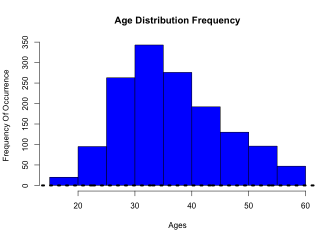

## Abstract

DDS Analytics is a analytics company that specializes in talent management solutions for Fortune 1000 companies. Talent management is defined as the iterative process of developing and retaining employees. It may include workforce planning, employee training programs, identifying high-potential employees and reducing/preventing voluntary employee turnover (attrition). To gain a competitive edge over its competition, DDS Analytics is planning to leverage data science for talent management. The executive leadership has identified predicting employee turnover as its first application of data science for talent management. This repo is the full data analysis of our findings after exploring the many facets of the data.

## I. Introduction

Talent is a precious commodity, especially in the corporate sector. Every organization no matter how big or small seeks not only to hire, but also to retain the best talent possible. Employee retention however, is much easier said than done these days, especially when the average amount of years an employee is likely to remain at a specific place of employment is [4.5 years](https://www.forbes.com/sites/davidsturt/2016/01/13/true-or-false-employees-today-only-stay-one-or-two-years/#6736606b6b4c) as of 2014. What are the factors that lead to employee attrition? This is an age old question that most companies continue to try to answer. Can employee attrition be slowed, or avoided all together? Is there any data to support that job satisfaction is the main cause for an employee remaining at a job? All these questions and more will be explored in this study. Our goal is to find sound answers to these questions rooted in strong statistical analysis of a dataset we have gathered from some of the most influential companies in the world.


## II. Background

As a Talent Management organization we set out to leverage the strength of Data Science in order to maintain the best employees at our organization DDS Analytics. In order for the organization to move forward in this endeavor it was neccessary to study the key factors in maintaining the best employees. As a result this study was launched by the management team in order to gain more insight into this arena.


## III.  Methodology

### Data Cleaning & Preparation

In order to make sure our data was ready for proper analysis we had to go through a series of steps in order to prepare the data. These steps include the following...

1. Data Import
2. Data Type Conversion
3. Factorization For Catagorical Variables
4. Handling of Missing or Inaccurate Values

We will discuss the process of each step below.

#### Data Import

We have obtained a dataset which incldudes 35 variables with 1470 observations. The dataset is will be referred to as `talentMgmtData`. In order to better understand our data we needed to proceed with cleaning it appropriately.

#### Data Type Conversion

Analysis could not be done properly if our variables are not in the correct type. Several of the numerical based variables showed up as doubles which was not neccessarily appropriate for research and analysis. For example, the years of experience for specfic employees needed to be converted to integer types, and Standard Working hours had no reason to show as a double, so it to was converted to an integer. This process was followed for each one of the 35 variables on order to ensure each columns assigned data type made sense for the context of the study.

#### Factorization For Catagorical Variables

Within our `talentMgmtData` we noticed that there were several columns that were improperly listed as integers when they were simply catagories. In order for us to be able to do factor analysis we picked out the columns that would be better suited to be catagories instead of integers so that we could get a better understanding of how our talent was spread out over different situations. For example, Columns like Department, BusinessTravel, Over18, & Jobsatisfaction to name a few, are all better suited to be treated as catagorical variables for our research purposes. As a result, we have converted the appropriate columns that explained how our data points were separated by making them factors instead of numerical values.

#### Handling of Missing or Inaccurate Values

In order for our mathematical calculations to work we had to convert many of our data points into numerical values so that our regression analysis would be more accurate. For example, DailyRate, Total Working Years, Years with Current Manager, are all examples of numerical based data points that can have mathematical operations performed on them. As a result we located variables like these and made sure the data type was appropriate giving us more flexibility during analysis.

#### DATA CLEANING

```r
#a.	Read the csv into R and take a look at the data set.  Output how many rows and columns the data.frame is.
library(readxl)
talentMgmtData <- read_excel("datasets/CaseStudy2-data.xlsx")
dim(talentMgmtData)
```

```
## [1] 1470   35
```

```r
#b	The column names are either too much or not enough.  Change the column names so that they do not have spaces, underscores, slashes, and the like. All column names should be under 12 characters. TODO: Make sure you're updating your codebook with information on the tidied data set as well.

names(talentMgmtData) <- c("Age","Attrition","BusinessTrvl","DailyRate","Department","DistFromHome","YrsOfEdu","EduField","EmployeeCnt","EmployeeNum","EnvSatfctn","Gender","HourlyRate","JobInvolmnt","JobLevel","JobRole","JobSatfctn","MaritalStat","MonthlyIncm","MonthlyRate","NumCmpWorked","Over18","OverTime","PrcntSalHike","PerfRating","RlnSatfctn","StandardHrs","StockOptLvl","TtlWrkngYrs","TrngTmsLstYr","WrkLifeBal","YrsAtCompany","YrsInCrntRl","YrsSncLstPrn","YrsWthCurMgr")

names(talentMgmtData)
```

```
##  [1] "Age"          "Attrition"    "BusinessTrvl" "DailyRate"   
##  [5] "Department"   "DistFromHome" "YrsOfEdu"     "EduField"    
##  [9] "EmployeeCnt"  "EmployeeNum"  "EnvSatfctn"   "Gender"      
## [13] "HourlyRate"   "JobInvolmnt"  "JobLevel"     "JobRole"     
## [17] "JobSatfctn"   "MaritalStat"  "MonthlyIncm"  "MonthlyRate" 
## [21] "NumCmpWorked" "Over18"       "OverTime"     "PrcntSalHike"
## [25] "PerfRating"   "RlnSatfctn"   "StandardHrs"  "StockOptLvl" 
## [29] "TtlWrkngYrs"  "TrngTmsLstYr" "WrkLifeBal"   "YrsAtCompany"
## [33] "YrsInCrntRl"  "YrsSncLstPrn" "YrsWthCurMgr"
```

```r
# c	Some columns are, due to Qualtrics, malfunctioning.

# TODO: Discuss with team, delete Over18 and StandardHrs(80hrs) columns
talentMgmtData$Over18 <- NULL
talentMgmtData <- subset(talentMgmtData, select = -c(StandardHrs))

# d	Make sure your columns are the proper data types (i.e., numeric, character, etc.).  If they are incorrect, convert them. 
str(talentMgmtData)
```

```
## Classes 'tbl_df', 'tbl' and 'data.frame':	1470 obs. of  33 variables:
##  $ Age         : num  41 49 37 33 27 32 59 30 38 36 ...
##  $ Attrition   : chr  "Yes" "No" "Yes" "No" ...
##  $ BusinessTrvl: chr  "Travel_Rarely" "Travel_Frequently" "Travel_Rarely" "Travel_Frequently" ...
##  $ DailyRate   : num  1102 279 1373 1392 591 ...
##  $ Department  : chr  "Sales" "Research & Development" "Research & Development" "Research & Development" ...
##  $ DistFromHome: num  1 8 2 3 2 2 3 24 23 27 ...
##  $ YrsOfEdu    : num  2 1 2 4 1 2 3 1 3 3 ...
##  $ EduField    : chr  "Life Sciences" "Life Sciences" "Other" "Life Sciences" ...
##  $ EmployeeCnt : num  1 1 1 1 1 1 1 1 1 1 ...
##  $ EmployeeNum : num  1 2 4 5 7 8 10 11 12 13 ...
##  $ EnvSatfctn  : num  2 3 4 4 1 4 3 4 4 3 ...
##  $ Gender      : chr  "Female" "Male" "Male" "Female" ...
##  $ HourlyRate  : num  94 61 92 56 40 79 81 67 44 94 ...
##  $ JobInvolmnt : num  3 2 2 3 3 3 4 3 2 3 ...
##  $ JobLevel    : num  2 2 1 1 1 1 1 1 3 2 ...
##  $ JobRole     : chr  "Sales Executive" "Research Scientist" "Laboratory Technician" "Research Scientist" ...
##  $ JobSatfctn  : num  4 2 3 3 2 4 1 3 3 3 ...
##  $ MaritalStat : chr  "Single" "Married" "Single" "Married" ...
##  $ MonthlyIncm : num  5993 5130 2090 2909 3468 ...
##  $ MonthlyRate : num  19479 24907 2396 23159 16632 ...
##  $ NumCmpWorked: num  8 1 6 1 9 0 4 1 0 6 ...
##  $ OverTime    : chr  "Yes" "No" "Yes" "Yes" ...
##  $ PrcntSalHike: num  11 23 15 11 12 13 20 22 21 13 ...
##  $ PerfRating  : num  3 4 3 3 3 3 4 4 4 3 ...
##  $ RlnSatfctn  : num  1 4 2 3 4 3 1 2 2 2 ...
##  $ StockOptLvl : num  0 1 0 0 1 0 3 1 0 2 ...
##  $ TtlWrkngYrs : num  8 10 7 8 6 8 12 1 10 17 ...
##  $ TrngTmsLstYr: num  0 3 3 3 3 2 3 2 2 3 ...
##  $ WrkLifeBal  : num  1 3 3 3 3 2 2 3 3 2 ...
##  $ YrsAtCompany: num  6 10 0 8 2 7 1 1 9 7 ...
##  $ YrsInCrntRl : num  4 7 0 7 2 7 0 0 7 7 ...
##  $ YrsSncLstPrn: num  0 1 0 3 2 3 0 0 1 7 ...
##  $ YrsWthCurMgr: num  5 7 0 0 2 6 0 0 8 7 ...
```

```r
#TODO: Discuss with team foll. factor levels of dataset
unique(talentMgmtData$BusinessTrvl)
```

```
## [1] "Travel_Rarely"     "Travel_Frequently" "Non-Travel"
```

```r
unique(talentMgmtData$JobRole)
```

```
## [1] "Sales Executive"           "Research Scientist"       
## [3] "Laboratory Technician"     "Manufacturing Director"   
## [5] "Healthcare Representative" "Manager"                  
## [7] "Sales Representative"      "Research Director"        
## [9] "Human Resources"
```

```r
unique(talentMgmtData$Attrition)
```

```
## [1] "Yes" "No"
```

```r
unique(talentMgmtData$Department)
```

```
## [1] "Sales"                  "Research & Development"
## [3] "Human Resources"
```

```r
unique(talentMgmtData$EduField)
```

```
## [1] "Life Sciences"    "Other"            "Medical"         
## [4] "Marketing"        "Technical Degree" "Human Resources"
```

```r
library(dplyr)
```

```
## 
## Attaching package: 'dplyr'
```

```
## The following objects are masked from 'package:stats':
## 
##     filter, lag
```

```
## The following objects are masked from 'package:base':
## 
##     intersect, setdiff, setequal, union
```

```r
#Get an Idea of the current format of the colums we are currently using.
glimpse(talentMgmtData)
```

```
## Observations: 1,470
## Variables: 33
## $ Age          <dbl> 41, 49, 37, 33, 27, 32, 59, 30, 38, 36, 35, 29, 3...
## $ Attrition    <chr> "Yes", "No", "Yes", "No", "No", "No", "No", "No",...
## $ BusinessTrvl <chr> "Travel_Rarely", "Travel_Frequently", "Travel_Rar...
## $ DailyRate    <dbl> 1102, 279, 1373, 1392, 591, 1005, 1324, 1358, 216...
## $ Department   <chr> "Sales", "Research & Development", "Research & De...
## $ DistFromHome <dbl> 1, 8, 2, 3, 2, 2, 3, 24, 23, 27, 16, 15, 26, 19, ...
## $ YrsOfEdu     <dbl> 2, 1, 2, 4, 1, 2, 3, 1, 3, 3, 3, 2, 1, 2, 3, 4, 2...
## $ EduField     <chr> "Life Sciences", "Life Sciences", "Other", "Life ...
## $ EmployeeCnt  <dbl> 1, 1, 1, 1, 1, 1, 1, 1, 1, 1, 1, 1, 1, 1, 1, 1, 1...
## $ EmployeeNum  <dbl> 1, 2, 4, 5, 7, 8, 10, 11, 12, 13, 14, 15, 16, 18,...
## $ EnvSatfctn   <dbl> 2, 3, 4, 4, 1, 4, 3, 4, 4, 3, 1, 4, 1, 2, 3, 2, 1...
## $ Gender       <chr> "Female", "Male", "Male", "Female", "Male", "Male...
## $ HourlyRate   <dbl> 94, 61, 92, 56, 40, 79, 81, 67, 44, 94, 84, 49, 3...
## $ JobInvolmnt  <dbl> 3, 2, 2, 3, 3, 3, 4, 3, 2, 3, 4, 2, 3, 3, 2, 4, 4...
## $ JobLevel     <dbl> 2, 2, 1, 1, 1, 1, 1, 1, 3, 2, 1, 2, 1, 1, 1, 3, 1...
## $ JobRole      <chr> "Sales Executive", "Research Scientist", "Laborat...
## $ JobSatfctn   <dbl> 4, 2, 3, 3, 2, 4, 1, 3, 3, 3, 2, 3, 3, 4, 3, 1, 2...
## $ MaritalStat  <chr> "Single", "Married", "Single", "Married", "Marrie...
## $ MonthlyIncm  <dbl> 5993, 5130, 2090, 2909, 3468, 3068, 2670, 2693, 9...
## $ MonthlyRate  <dbl> 19479, 24907, 2396, 23159, 16632, 11864, 9964, 13...
## $ NumCmpWorked <dbl> 8, 1, 6, 1, 9, 0, 4, 1, 0, 6, 0, 0, 1, 0, 5, 1, 0...
## $ OverTime     <chr> "Yes", "No", "Yes", "Yes", "No", "No", "Yes", "No...
## $ PrcntSalHike <dbl> 11, 23, 15, 11, 12, 13, 20, 22, 21, 13, 13, 12, 1...
## $ PerfRating   <dbl> 3, 4, 3, 3, 3, 3, 4, 4, 4, 3, 3, 3, 3, 3, 3, 3, 3...
## $ RlnSatfctn   <dbl> 1, 4, 2, 3, 4, 3, 1, 2, 2, 2, 3, 4, 4, 3, 2, 3, 4...
## $ StockOptLvl  <dbl> 0, 1, 0, 0, 1, 0, 3, 1, 0, 2, 1, 0, 1, 1, 0, 1, 2...
## $ TtlWrkngYrs  <dbl> 8, 10, 7, 8, 6, 8, 12, 1, 10, 17, 6, 10, 5, 3, 6,...
## $ TrngTmsLstYr <dbl> 0, 3, 3, 3, 3, 2, 3, 2, 2, 3, 5, 3, 1, 2, 4, 1, 5...
## $ WrkLifeBal   <dbl> 1, 3, 3, 3, 3, 2, 2, 3, 3, 2, 3, 3, 2, 3, 3, 3, 2...
## $ YrsAtCompany <dbl> 6, 10, 0, 8, 2, 7, 1, 1, 9, 7, 5, 9, 5, 2, 4, 10,...
## $ YrsInCrntRl  <dbl> 4, 7, 0, 7, 2, 7, 0, 0, 7, 7, 4, 5, 2, 2, 2, 9, 2...
## $ YrsSncLstPrn <dbl> 0, 1, 0, 3, 2, 3, 0, 0, 1, 7, 0, 0, 4, 1, 0, 8, 0...
## $ YrsWthCurMgr <dbl> 5, 7, 0, 0, 2, 6, 0, 0, 8, 7, 3, 8, 3, 2, 3, 8, 5...
```

```r
# Factor appropriate columns 
talentMgmtData$Department <- as.factor(talentMgmtData$Department)
talentMgmtData$BusinessTrvl <- as.factor(talentMgmtData$BusinessTrvl)
talentMgmtData$OverTime <- as.factor(talentMgmtData$OverTime)
talentMgmtData$EduField <- as.factor(talentMgmtData$EduField)
talentMgmtData$Gender <- as.factor(talentMgmtData$Gender)
talentMgmtData$Attrition <- as.factor(talentMgmtData$Attrition)
talentMgmtData$MaritalStat <- as.factor(talentMgmtData$MaritalStat)
talentMgmtData$JobRole <- as.factor(talentMgmtData$JobRole)
talentMgmtData$EnvSatfctn <- as.factor(talentMgmtData$EnvSatfctn)
talentMgmtData$JobLevel <- as.factor(talentMgmtData$JobLevel)
talentMgmtData$StockOptLvl <- as.factor(talentMgmtData$StockOptLvl)
talentMgmtData$PerfRating <- as.factor(talentMgmtData$PerfRating)
talentMgmtData$EmployeeCnt <- as.factor(talentMgmtData$EmployeeCnt)
talentMgmtData$JobInvolmnt <- as.factor(talentMgmtData$JobInvolmnt)
talentMgmtData$RlnSatfctn <- as.factor(talentMgmtData$RlnSatfctn)
talentMgmtData$WrkLifeBal <- as.factor(talentMgmtData$WrkLifeBal)
talentMgmtData$JobSatfctn <- as.factor(talentMgmtData$JobSatfctn)
# handle numeric based columns to show as double or integer if need be.
talentMgmtData$Age <- as.integer(talentMgmtData$Age)
talentMgmtData$EmployeeNum <- as.integer(talentMgmtData$EmployeeNum)
talentMgmtData$DistFromHome <- as.integer(talentMgmtData$DistFromHome)
talentMgmtData$YrsOfEdu <- as.integer(talentMgmtData$YrsOfEdu)
talentMgmtData$DailyRate <- as.numeric(talentMgmtData$DailyRate)
talentMgmtData$TtlWrkngYrs <- as.integer(talentMgmtData$TtlWrkngYrs)
talentMgmtData$YrsAtCompany <- as.integer(talentMgmtData$YrsAtCompany)
talentMgmtData$NumCmpWorked <- as.integer(talentMgmtData$NumCmpWorked)
talentMgmtData$YrsInCrntRl <- as.integer(talentMgmtData$YrsInCrntRl)
talentMgmtData$YrsSncLstPrn <- as.integer(talentMgmtData$YrsSncLstPrn)
talentMgmtData$YrsWthCurMgr <- as.integer(talentMgmtData$YrsWthCurMgr)
talentMgmtData$TrngTmsLstYr <- as.integer(talentMgmtData$TrngTmsLstYr)
#Take a look at data after type conversions are applied to the appropriate columns
glimpse(talentMgmtData)
```

```
## Observations: 1,470
## Variables: 33
## $ Age          <int> 41, 49, 37, 33, 27, 32, 59, 30, 38, 36, 35, 29, 3...
## $ Attrition    <fctr> Yes, No, Yes, No, No, No, No, No, No, No, No, No...
## $ BusinessTrvl <fctr> Travel_Rarely, Travel_Frequently, Travel_Rarely,...
## $ DailyRate    <dbl> 1102, 279, 1373, 1392, 591, 1005, 1324, 1358, 216...
## $ Department   <fctr> Sales, Research & Development, Research & Develo...
## $ DistFromHome <int> 1, 8, 2, 3, 2, 2, 3, 24, 23, 27, 16, 15, 26, 19, ...
## $ YrsOfEdu     <int> 2, 1, 2, 4, 1, 2, 3, 1, 3, 3, 3, 2, 1, 2, 3, 4, 2...
## $ EduField     <fctr> Life Sciences, Life Sciences, Other, Life Scienc...
## $ EmployeeCnt  <fctr> 1, 1, 1, 1, 1, 1, 1, 1, 1, 1, 1, 1, 1, 1, 1, 1, ...
## $ EmployeeNum  <int> 1, 2, 4, 5, 7, 8, 10, 11, 12, 13, 14, 15, 16, 18,...
## $ EnvSatfctn   <fctr> 2, 3, 4, 4, 1, 4, 3, 4, 4, 3, 1, 4, 1, 2, 3, 2, ...
## $ Gender       <fctr> Female, Male, Male, Female, Male, Male, Female, ...
## $ HourlyRate   <dbl> 94, 61, 92, 56, 40, 79, 81, 67, 44, 94, 84, 49, 3...
## $ JobInvolmnt  <fctr> 3, 2, 2, 3, 3, 3, 4, 3, 2, 3, 4, 2, 3, 3, 2, 4, ...
## $ JobLevel     <fctr> 2, 2, 1, 1, 1, 1, 1, 1, 3, 2, 1, 2, 1, 1, 1, 3, ...
## $ JobRole      <fctr> Sales Executive, Research Scientist, Laboratory ...
## $ JobSatfctn   <fctr> 4, 2, 3, 3, 2, 4, 1, 3, 3, 3, 2, 3, 3, 4, 3, 1, ...
## $ MaritalStat  <fctr> Single, Married, Single, Married, Married, Singl...
## $ MonthlyIncm  <dbl> 5993, 5130, 2090, 2909, 3468, 3068, 2670, 2693, 9...
## $ MonthlyRate  <dbl> 19479, 24907, 2396, 23159, 16632, 11864, 9964, 13...
## $ NumCmpWorked <int> 8, 1, 6, 1, 9, 0, 4, 1, 0, 6, 0, 0, 1, 0, 5, 1, 0...
## $ OverTime     <fctr> Yes, No, Yes, Yes, No, No, Yes, No, No, No, No, ...
## $ PrcntSalHike <dbl> 11, 23, 15, 11, 12, 13, 20, 22, 21, 13, 13, 12, 1...
## $ PerfRating   <fctr> 3, 4, 3, 3, 3, 3, 4, 4, 4, 3, 3, 3, 3, 3, 3, 3, ...
## $ RlnSatfctn   <fctr> 1, 4, 2, 3, 4, 3, 1, 2, 2, 2, 3, 4, 4, 3, 2, 3, ...
## $ StockOptLvl  <fctr> 0, 1, 0, 0, 1, 0, 3, 1, 0, 2, 1, 0, 1, 1, 0, 1, ...
## $ TtlWrkngYrs  <int> 8, 10, 7, 8, 6, 8, 12, 1, 10, 17, 6, 10, 5, 3, 6,...
## $ TrngTmsLstYr <int> 0, 3, 3, 3, 3, 2, 3, 2, 2, 3, 5, 3, 1, 2, 4, 1, 5...
## $ WrkLifeBal   <fctr> 1, 3, 3, 3, 3, 2, 2, 3, 3, 2, 3, 3, 2, 3, 3, 3, ...
## $ YrsAtCompany <int> 6, 10, 0, 8, 2, 7, 1, 1, 9, 7, 5, 9, 5, 2, 4, 10,...
## $ YrsInCrntRl  <int> 4, 7, 0, 7, 2, 7, 0, 0, 7, 7, 4, 5, 2, 2, 2, 9, 2...
## $ YrsSncLstPrn <int> 0, 1, 0, 3, 2, 3, 0, 0, 1, 7, 0, 0, 4, 1, 0, 8, 0...
## $ YrsWthCurMgr <int> 5, 7, 0, 0, 2, 6, 0, 0, 8, 7, 3, 8, 3, 2, 3, 8, 5...
```

### Preliminary Analysis


##### Understanding our Ages and its' Relationships with other Factors.

---

Now that the data has been prepared and formatted accordingly it is neccessary to explore it to its depths. For a dataset this large we will start off taking a look at some of the variables of interests and how they relate to each other.

When it comes to jobs the first thing that we want to look at is our age distribution. This is an imporatant step in our EDA process as we would like to get an idea of how old or young our these individuals in our entire dataset as it might give us a good place to start. We are only interested in exploring individuals in the workforce that are older than 18, so all of the forward analysis will take this constraint into consideration.


```r
talentData <- talentMgmtData[talentMgmtData$Age > 18, ]
range(talentData$Age)
```

```
## [1] 19 60
```

As we can see above, only Ages 19 to 60 exists within our dataset.


```r
par(mfrow=c(1,2))
hist(talentData$Age, xlab= "Ages",
     ylab="Frequency Of Occurrence",
     main= "Age Distribution Frequency",
     col = "blue")
hist(talentData$Age,
     xlab= "Ages",
     col="green",
     freq= FALSE,  ylab= "Density of Ages", main= "Age Distribution Density")
lines(density(talentMgmtData$Age), lty="dotted", lwd=4)
```

<!-- -->

Based on the chart above we can see that our age range is between 20 and 60 with a large portion of ages being between 25 and 45. This is insightful as it might help us with interpretation of our findings moving forward. It is also worth noting that  between 30 and 35  is the most occurring age of all the age groups with over 350 recorded ages within this group!

Another thing that we would like to explore is whether or not there is a relationship between our Ages and the number of years they have spent at a specific company. If there is a relationship, we would like to understand whether or not the relationship is positive or negatively correlated.


```r
library(ggplot2)

ggplot(talentData, aes(x=Age, y=YrsAtCompany)) +
  ggtitle("Years at Company vs Age") +
  theme(plot.title = element_text(hjust = 0.5)) +
  labs(x= "Age", y="Years") +
  geom_point(shape=1, col = "purple") +
  geom_smooth(method = "gam")
```

<!-- -->

Our findings here are not surprising. We notice that visually there might be evidence of a positive linear relationship between age and years at a specific company. This finding suggests that the older you are the more likely you are to have a greater number of years at a specific company. To know for sure we examine pearson correlation between `YrsAtCompany` and `Age`.


```r
cor.test(x=talentData$Age, y=talentData$YrsAtCompany,
         alternative = "two.sided",
         method="pearson",
         conf.level = 0.95,
         exact = TRUE)
```

```
## 
## 	Pearson's product-moment correlation
## 
## data:  talentData$Age and talentData$YrsAtCompany
## t = 12.148, df = 1460, p-value < 2.2e-16
## alternative hypothesis: true correlation is not equal to 0
## 95 percent confidence interval:
##  0.2556936 0.3488375
## sample estimates:
##      cor 
## 0.302989
```

Based on the results of our correlation test we have a pearsons correlation value of `0.302989` (95% CI: 0.25 to 0.34) which is more evidence of a positive linear relationship between Age and Years at a specific company. It is important for us to keep this relationship in mind moving forward for the rest of the study.

##### Understaning Incomes in the dataset

The next important thing we want to explore is our income distribution. Income is a major factor in employment. Without income, there is no reason for anyone worker to make effort to join a company in the first place. We would like to get an Idea of how the income distribution looks within our dataset. We would also like to understand the relationship between our income and our age as this might give us more insight as to whether or not these two factors influence employee retention overall.


```r
par(mfrow=c(1,2))
hist(talentData$MonthlyIncm,
     xlab="Monthly Income",
     ylab="Frequency Of Occurrence",
     main= "Income Distribution Frequency",
     col= "grey")
hist(talentData$MonthlyIncm,
     xlab= "Monthly Income",
     col="grey",
     freq= FALSE,
     ylab= "Density of Monthly Incomes",
     main="Income Distribution Density")
lines(density(talentData$MonthlyIncm), lty="dotted", lwd=4)
```

<!-- -->

If we examine the Monthly Income of our talent datapoints we can see a right skewed distribution for the monthly salaries. It is also clear that a large amount of the incomes here are clustered from appropximately \$1000 to \$6,000 per month. Now that we have have an understanding of how incomes are distributed we will examine the relationship between age and income to see if a relationship exists.


```r
library(ggplot2)

ggplot(talentData, aes(x=MonthlyIncm, y=Age)) +
  ggtitle("Monthly Income vs Age") +
  theme(plot.title = element_text(hjust = 0.5)) +
  labs(x= "Income", y="Age") +
  geom_point(shape=1, col = "orange") +
  geom_smooth(method = "gam")
```

<!-- -->

```r
cor.test(x=talentData$MonthlyIncm, y=talentData$Age,
         alternative = "two.sided",
         method="pearson",
         conf.level = 0.95,
         exact = TRUE)
```

```
## 
## 	Pearson's product-moment correlation
## 
## data:  talentData$MonthlyIncm and talentData$Age
## t = 21.662, df = 1460, p-value < 2.2e-16
## alternative hypothesis: true correlation is not equal to 0
## 95 percent confidence interval:
##  0.4533721 0.5310174
## sample estimates:
##       cor 
## 0.4931764
```


There is no surprise here as both the chart and a pearson's correlation test confirms that there is a positive linear relationship between `MonthlyIncome` and `Age` `r=0.49`(95% CI: 0.45 to 0.53). This suggests that the older someone is it could affect both their salary and years at a company in a positive way. This finding also might suggest that we could consider age as a factor in employee retention as it seems to be closely related to Income as well as the number of years at a company. Perhaps older employees will stay at a company longer because they make more money making them less likely to leave. We continue to search for evidence to help us answer this question of employee attrition, but for now it is clear that Age is definately a variable we want to factor into our analysis given its influence on both Monthly Income and years spent at a company.

##### Exploring the Relationship between Years At a company and Satisfaction

Now that we know that Age, and Income have a positive impact on employee retention we would like to visually confirm our assumption that Job Satisfaction also contributes in a major way to someone remaining at a company. We can do this by examining our different levels of employee satisfaction and their Years they have remained at a particular company.


```r
ggplot(talentData, aes(YrsAtCompany)) +
  geom_density(aes(fill=JobSatfctn), alpha=0.8) +
  labs(title= "Years At Company Density Plot",
       subtitle="Years at Company grouped by Job Satisfaction",
       x="Years at Company",
       y="Density")
```

<!-- -->

The Chart above is very telling. We take a look at our probability distribution across different Job Satisfaction levels. 1 indicates that there is low employee job satisfaction, and 4 represents that there is really high employee job satisfaction. If we examine the probability of each within the context of the years an individual stays at a company it becomes clear that lower job satisfaction indicates that this catagory has the lowest number of years spent at a company. This is no surprise, but it does give us more infomration regarding negative factors to employee attrition.

##### Correlation Plot of TalentData

In our data set there are a large number of numerical based values. We would like to get an idea of the relationship of those variables relate to one another in one glance. Below is a comprised chart of all the correlations regarding our talent data.


```r
library(ggcorrplot)

continuous_vars <- talentData[, c("YrsWthCurMgr",
                                  "YrsSncLstPrn",
                                  "YrsInCrntRl",
                                  "YrsAtCompany",
                                  "TrngTmsLstYr",
                                  "TtlWrkngYrs",
                                  "PrcntSalHike",
                                  "MonthlyIncm",
                                  "HourlyRate",
                                  "DailyRate",
                                  "Age",
                                  "DistFromHome",
                                  "YrsOfEdu")]

correlations <- round(cor(continuous_vars), 1)

ggcorrplot(correlations, hc.order = TRUE,
           type = "lower",
           lab = TRUE,
           lab_size = 4,
           method="circle",
           colors= c("tomato2", "white", "springgreen3"),
           title = "Correlation Chart For TalentData",
           ggtheme=theme_bw)
```

<!-- -->

The chart above shows us that there are no negative linear relationships in our data between our variables. We can also see that there are some positive relationships between variables that are linearly correlated and we have now been able to narrow these down so they can be examined in depth.

#### Descriptive statistics

Lets check descriptive statistics for some of the data we have

```r
library(knitr)
library(kableExtra)
DescriptiveStatistics<-c("min", "max", "mean", "sd")
HourlyRate <- c(min(talentData$HourlyRate), max(talentData$HourlyRate), mean(talentData$HourlyRate), sd(talentData$HourlyRate))
MonthlyIncome <- c(min(talentData$MonthlyIncm), max(talentData$MonthlyIncm), mean(talentData$MonthlyIncm), sd(talentData$MonthlyIncm))
TotalWorkYears <- c(min(talentData$TtlWrkngYrs), max(talentData$TtlWrkngYrs), mean(talentData$TtlWrkngYrs), sd(talentData$TtlWrkngYrs))
Age <- c(min(talentData$Age), max(talentData$Age), mean(talentData$Age), sd(talentData$Age)) 
YearsAtCompany <-c(min(talentData$YrsAtCompany), max(talentData$YrsAtCompany), mean(talentData$YrsAtCompany), sd(talentData$YrsAtCompany))
MonthlyRate <- c(min(talentData$MonthlyRate), max(talentData$MonthlyRate), mean(talentData$MonthlyRate), sd(talentData$MonthlyRate))
YrsOfEdu <- c(min(talentData$YrsOfEdu), max(talentData$YrsOfEdu), mean(talentData$YrsOfEdu), sd(talentData$YrsOfEdu))
table <- data.frame(DescriptiveStatistics, HourlyRate, MonthlyRate, MonthlyIncome, TotalWorkYears, YearsAtCompany, Age,  YrsOfEdu)
table %>%
  kable("html") %>%
  kable_styling()
```

<table class="table" style="margin-left: auto; margin-right: auto;">
 <thead>
  <tr>
   <th style="text-align:left;"> DescriptiveStatistics </th>
   <th style="text-align:right;"> HourlyRate </th>
   <th style="text-align:right;"> MonthlyRate </th>
   <th style="text-align:right;"> MonthlyIncome </th>
   <th style="text-align:right;"> TotalWorkYears </th>
   <th style="text-align:right;"> YearsAtCompany </th>
   <th style="text-align:right;"> Age </th>
   <th style="text-align:right;"> YrsOfEdu </th>
  </tr>
 </thead>
<tbody>
  <tr>
   <td style="text-align:left;"> min </td>
   <td style="text-align:right;"> 30.00000 </td>
   <td style="text-align:right;"> 2094.000 </td>
   <td style="text-align:right;"> 1009.000 </td>
   <td style="text-align:right;"> 0.000000 </td>
   <td style="text-align:right;"> 0.000000 </td>
   <td style="text-align:right;"> 19.000000 </td>
   <td style="text-align:right;"> 1.000000 </td>
  </tr>
  <tr>
   <td style="text-align:left;"> max </td>
   <td style="text-align:right;"> 100.00000 </td>
   <td style="text-align:right;"> 26999.000 </td>
   <td style="text-align:right;"> 19999.000 </td>
   <td style="text-align:right;"> 40.000000 </td>
   <td style="text-align:right;"> 40.000000 </td>
   <td style="text-align:right;"> 60.000000 </td>
   <td style="text-align:right;"> 5.000000 </td>
  </tr>
  <tr>
   <td style="text-align:left;"> mean </td>
   <td style="text-align:right;"> 65.87893 </td>
   <td style="text-align:right;"> 14312.212 </td>
   <td style="text-align:right;"> 6530.207 </td>
   <td style="text-align:right;"> 11.341313 </td>
   <td style="text-align:right;"> 7.046512 </td>
   <td style="text-align:right;"> 37.027360 </td>
   <td style="text-align:right;"> 2.915185 </td>
  </tr>
  <tr>
   <td style="text-align:left;"> sd </td>
   <td style="text-align:right;"> 20.34338 </td>
   <td style="text-align:right;"> 7124.669 </td>
   <td style="text-align:right;"> 4706.273 </td>
   <td style="text-align:right;"> 7.757034 </td>
   <td style="text-align:right;"> 6.121228 </td>
   <td style="text-align:right;"> 9.052093 </td>
   <td style="text-align:right;"> 1.025173 </td>
  </tr>
</tbody>
</table>
####3.B####
The average Hourly rate is $65.88/hour, the average Monthly Rate is $14,312.21/month, the average Monthly Income is $6,530.21/month, average Total Worked Years is 11.34 years, average Worked years at the company is 7.04 years, average Age of the employees is 37 years and average Years of Education of the employees is 2.9 years ('Bachelor' degree).

Lets check histograms of Hourly Rate and Monthly income.


```r
hist(talentData$HourlyRate, col = "darkred", xlab="Hourly Rate", main="Histogram of Hourly Rate")
```

<!-- -->

```r
hist(talentData$MonthlyIncm, col = "darkgreen", xlab="Monthly Income", main="Histogram of Monthly Income")
```

<!-- -->

#### 3.B####

On the histograms we can see almost equal spread of hourly rates within the company, but we can not say the same about monthly income, it means that employees work different amount of hours (some of them are part time, and some of them work with overtime (more then 40hours), we do not have information if any bonuses were paid in the company, so it does not make sense to continue analize working hours). 

##### Understanding Gender, Education, & Occupations

Next we explore how Gender, Education and Occupation is broken down within our dataset. To get a good idea of how these factors might or might not play into attrition we need to first determine what these factors initally look like and how they are spread out.

First we examine the frequency for gender and how it is distributed across job roles.


```r
demographics <- talentData[,c("JobRole", "Gender", "EduField")]


theme_set(theme_light())

ggplot(demographics, aes(demographics$JobRole)) + 
  geom_bar(aes(fill=Gender), width = 0.5) +
  labs(title = "Gender by Job Role",
       subtitle = "Men & Women in Specific JobRole",
       x = "Job Role",
       y = "Frequency") +
  coord_flip()
```

<!-- -->

Our chart shows a bimodal distribution of our job roles. What is interesting here is we can see that sales executive is the most commonly occuring job in our dataset with more than 300 people represented in that category. It is also interesting to note that the spread between male and female in that job catagory looks almost equally represented. Our Lowest category is Human Resources Which has partitioned of mostly males even though there are just under 50 people in this catagory as a whole.

What about Education? How is education represented across the genders. We take a look at that distribution next.


```r
theme_set(theme_dark())

ggplot(demographics, aes(demographics$EduField)) + 
  geom_bar(aes(fill=Gender), width = 0.5) +
  labs(title = "Gender by Field Of Education",
       subtitle = "A breakdown in what fields of education was explored by the genders",
       x = "Field Of Study",
       y = "Frequency") +
  coord_flip()
```

<!-- -->

We can see from this chart that Human Resources has the lowest participation in terms of education which actually makes sense given that it is our lowest filled job role. Life Science seems to be the most popular field of study between all the listed education choices with 600 different people in our dataset who studied in this field. This does not neccesarily match with our discovery regarding our popular job role. Life Science skills can translate into making great Sales Executives, but this educational field of study does not seem to be directly related to the Sales Executive.

Now that we have an overall view of our data now we can begin to try to answer our questions of interest regarding our dataset. Our questions of interest are simply the following...

1. What are the factors that lead to employee attrition?
2. Can employee attrition be slowed, or avoided all together?

Our next section will use all of our recent discoveries about the `talentData` to answer these inquiries.

## IV. Deeper Analysis and Visualization

Let's check if there is any relationship between Age and Income. Does Gender makes any effect on the Monthly income?


```r
MonthlyIncm <- talentData$MonthlyIncm
Age <- talentData$Age
Gender <- talentData$Gender
ggplot(talentData, aes(MonthlyIncm, Age, color = Gender, shape=Gender))+geom_point()+ggtitle("Correlation between Monthly income and Ages")
```

<!-- -->

```r
model_AgeIncome <- lm(MonthlyIncm ~ Age+Gender, data = talentData)
summary(model_AgeIncome)
```

```
## 
## Call:
## lm(formula = MonthlyIncm ~ Age + Gender, data = talentData)
## 
## Residuals:
##     Min      1Q  Median      3Q     Max 
## -9927.2 -2623.9  -711.1  1817.3 12595.1 
## 
## Coefficients:
##             Estimate Std. Error t value Pr(>|t|)    
## (Intercept) -2872.67     475.14  -6.046 1.88e-09 ***
## Age           256.12      11.85  21.616  < 2e-16 ***
## GenderMale   -134.31     218.91  -0.614     0.54    
## ---
## Signif. codes:  0 '***' 0.001 '**' 0.01 '*' 0.05 '.' 0.1 ' ' 1
## 
## Residual standard error: 4096 on 1459 degrees of freedom
## Multiple R-squared:  0.2434,	Adjusted R-squared:  0.2424 
## F-statistic: 234.7 on 2 and 1459 DF,  p-value: < 2.2e-16
```
####4.C####
From regression analysis above we can say that Gender does not make significant change in the Monthly employee income. But Age is indeed significant variable (p<0.0001), it can explain 24% of monthly income change.

#### What Factor Causes Employee Attrition?


#### Can This be stopped?

## V. Discussion And Conclusions


## References


